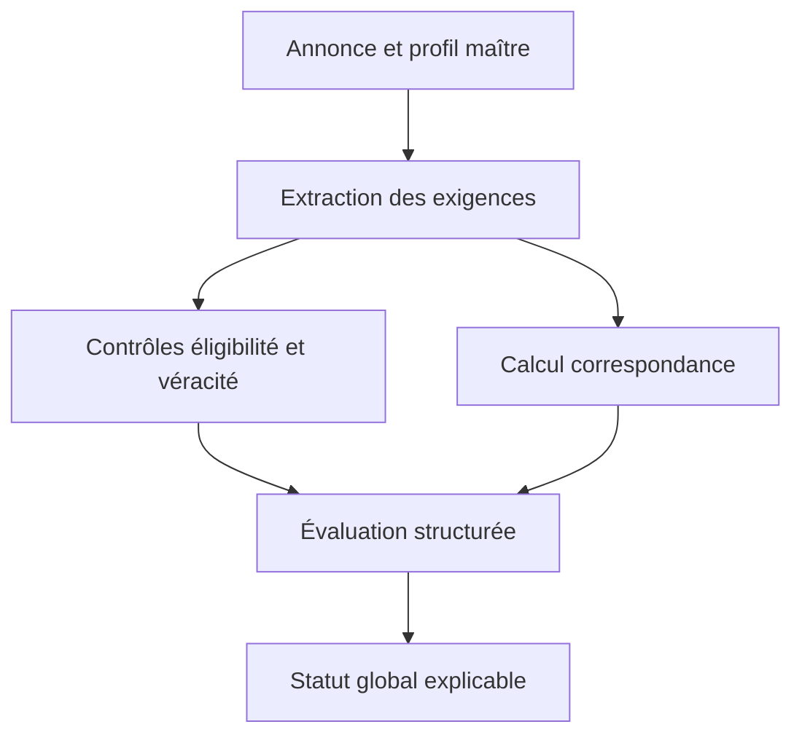
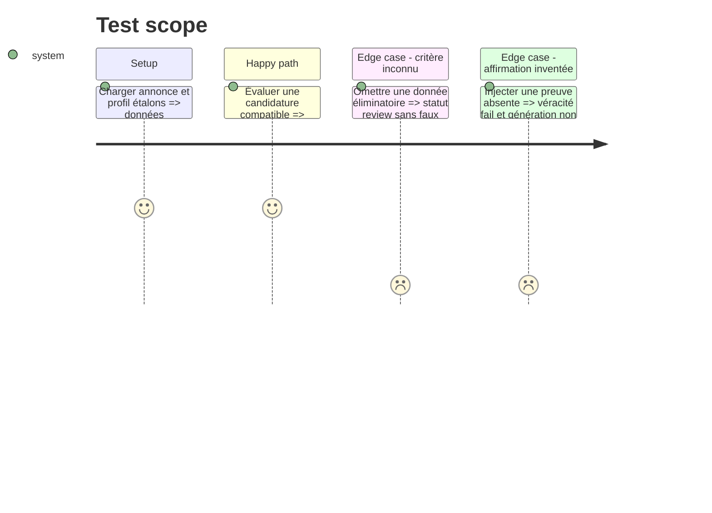

# Instruction: Modèle d’évaluation et calcul déterministe

## Architecture projection

> Tree of the final files. ✅ create · ✏️ modify · ❌ delete

```txt
.
├── config/
│   └── cv_assessment.json                 ✅ pondérations, seuils et version du schéma
├── cv_generator/
│   ├── ai_agents.py                       ✏️ sorties structurées et preuves du juge IA
│   ├── cv_assessment.py                   ✅ statuts, scores et agrégation déterministe
│   └── cv_quality_checker.py               ✏️ contrôles Python convertis au nouveau schéma
├── data/
│   └── cv_master_profile.json              ✏️ faits d’éligibilité confirmés ou inconnus
└── tests/
    └── test_cv_assessment.py               ✅ tests unitaires du modèle et des seuils
```

## User Journey



## Test Scope



## Tasks to do

### `1)` Définir le contrat versionné

> Formaliser une sortie stable, lisible par Python, le backend et le frontend.

1. Créer `cv_assessment_v1` avec `eligibility`, `parseability`, `match`, `human_quality`, `truthfulness` et `overall_status`.
2. Utiliser `pass`, `fail` ou `review` pour les contrôles et des scores 0–100 uniquement pour les dimensions graduelles.
3. Documenter chaque composante avec `reason`, `evidence` et `missing`.

### `2)` Configurer les pondérations

> Sortir les seuils du prompt et les rendre testables.

1. Définir la correspondance : compétences requises 35, expériences prouvées 30, métier/contexte 15, formation/certifications 10, contraintes 10.
2. Définir une grille séparée pour la qualité humaine.
3. Définir les seuils initiaux et la règle de blocage des contrôles `fail`.

### `3)` Calculer à partir de preuves

> Faire du résultat Python l’autorité finale.

1. Extraire les exigences obligatoires, souhaitées et inconnues dans une structure bornée.
2. Relier chaque point obtenu à une compétence, expérience, formation ou fait du profil maître.
3. Refuser tout point sans preuve et marquer les informations absentes `review`.

### `4)` Adapter le juge IA

> Utiliser l’IA pour l’analyse sémantique sans lui déléguer la note finale.

1. Demander des critères classés, des preuves et des écarts, sans score libre.
2. Sanitariser les identifiants et références contre le profil maître.
3. Conserver les problèmes qualité existants dans le nouveau contrat.

## Test acceptance criteria

| Task | Acceptance criteria |
| ---- | ------------------- |
| 1 | Une évaluation JSON valide contient les cinq dimensions et un numéro de schéma. |
| 2 | Les poids de correspondance totalisent exactement 100 et toute configuration invalide échoue explicitement. |
| 3 | Aucun point n’est accordé à une compétence, expérience ou formation sans preuve dans le profil maître. |
| 3 | Une donnée éliminatoire absente produit `review`, tandis qu’une incompatibilité confirmée produit `fail`. |
| 4 | Deux fournisseurs IA proposant les mêmes preuves produisent les mêmes scores finaux. |
