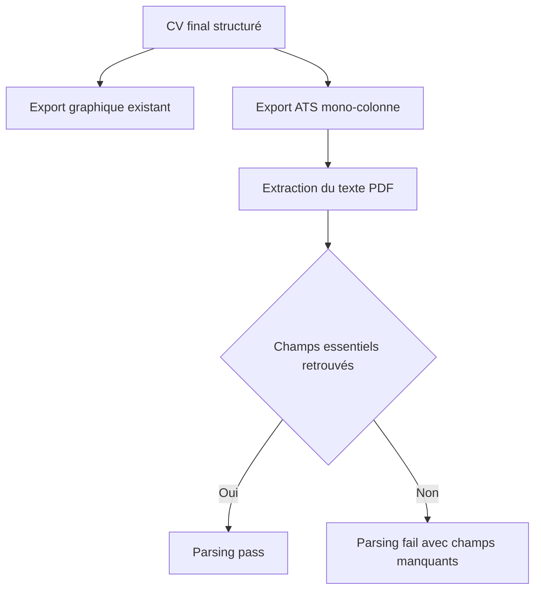
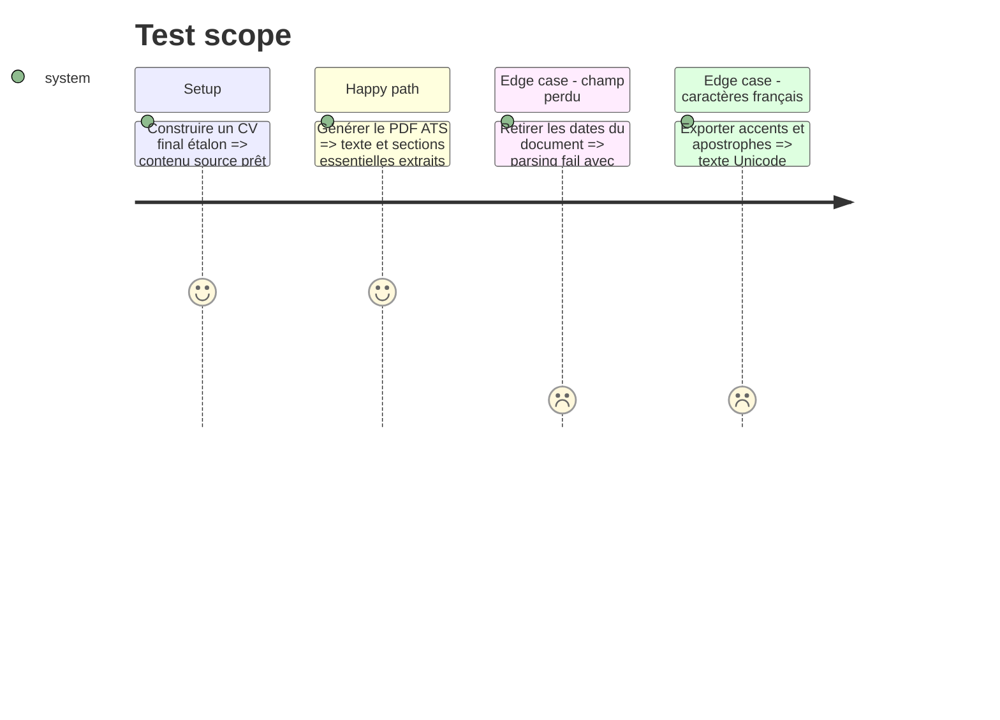

# Instruction: Export ATS et validation du parsing

## Architecture projection

> Tree of the final files. ✅ create · ✏️ modify · ❌ delete

```txt
.
├── cv_generator/
│   ├── ats_exporter.py                     ✅ export HTML et PDF mono-colonne sans éléments décoratifs
│   ├── ats_validator.py                    ✅ extraction et contrôle des champs essentiels
│   ├── exporters.py                        ✏️ conserve les exports graphiques existants
│   └── pipeline.py                         ✏️ génère les nouveaux fichiers et injecte le parsing dans l’évaluation
├── requirements.txt                        ✏️ dépendance `pypdf` épinglée
└── tests/
    ├── test_ats_exporter.py                ✅ structure et contenu de la sortie ATS
    └── test_cv_generator.py                ✏️ contrat complet des fichiers générés
```

## User Journey



## Test Scope



## Tasks to do

### `1)` Produire une version ATS dédiée

> Générer un document simple sans sacrifier le CV graphique actuel.

1. Utiliser une colonne, des titres standards et du texte sélectionnable.
2. Exclure photo, tableaux, zones flottantes, en-têtes, pieds de page et icônes décoratives.
3. Conserver l’ordre identité, titre, compétences, expériences, formation et langues.

### `2)` Vérifier le PDF réellement produit

> Contrôler le document final plutôt que son JSON source.

1. Extraire le texte avec `pypdf` après génération.
2. Vérifier nom, coordonnées, intitulé, organisations, postes, dates, compétences prioritaires et formations sélectionnées.
3. Produire les champs retrouvés, manquants et ambigus dans `parseability`.

### `3)` Intégrer les sorties au pipeline

> Livrer ensemble le CV, son évaluation et sa preuve de parsing.

1. Générer `cv_ats.html`, `cv_ats.pdf` et `cv_assessment.json`.
2. Conserver seulement `cv_final.pdf`, `cv_final.html` et `cv_final.json` pour la version design et structurée.
3. Arrêter de générer `cv_draft.md`, `cv_final.md` et `cv_canva_copy.md`.
4. Réévaluer le statut global après la validation du PDF ATS.

## Test acceptance criteria

| Task | Acceptance criteria |
| ---- | ------------------- |
| 1 | Le PDF ATS est mono-colonne, sans photo, et toutes ses informations visibles proviennent du CV final sourcé. |
| 2 | Le validateur lit le PDF généré et retrouve les champs essentiels ainsi que les caractères français. |
| 2 | La disparition d’un champ essentiel produit `parseability.status = fail` avec le champ nommé. |
| 3 | Une génération réussie produit les deux familles d’exports et un fichier d’évaluation cohérent. |
| 3 | Aucun nouveau dossier de candidature ne contient de sortie Markdown ou Canva. |
| 3 | Un échec de parsing empêche le statut global `ready` sans supprimer le CV graphique. |
