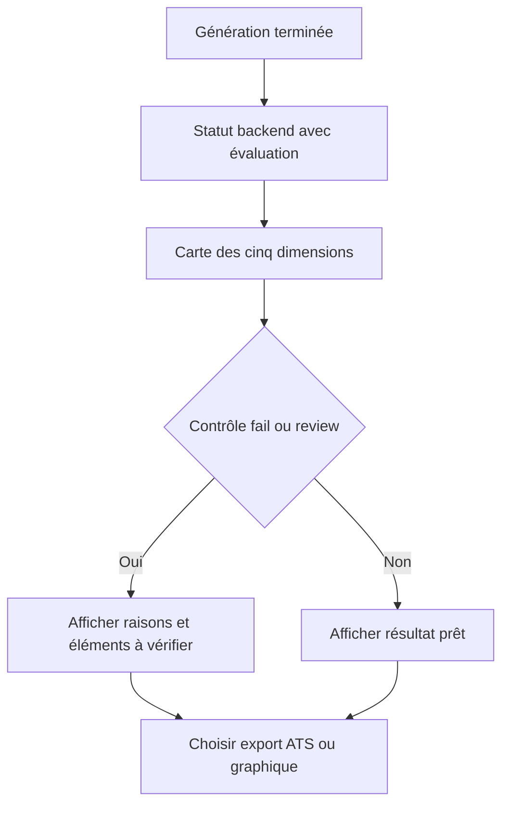
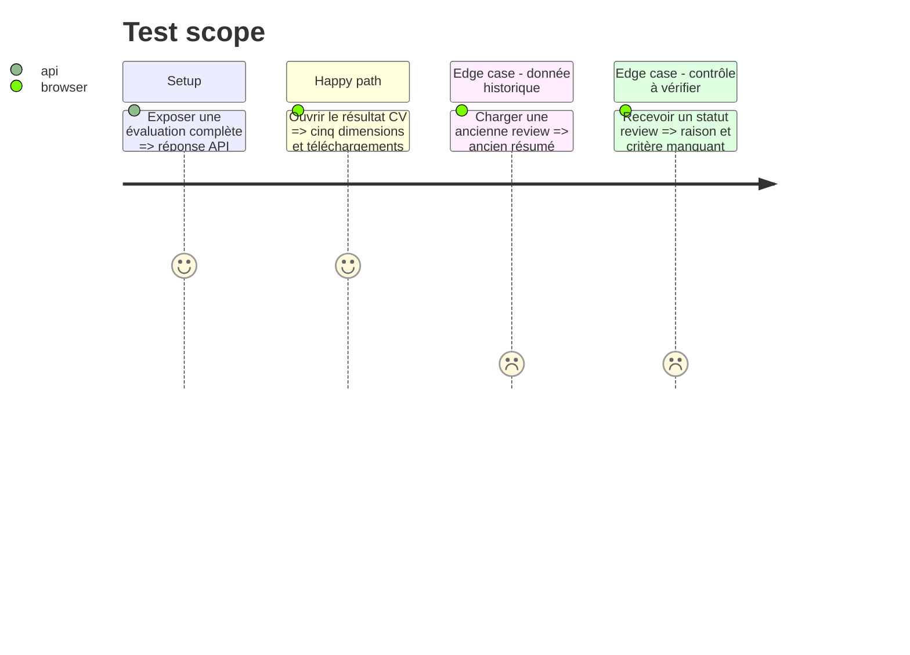

# Instruction: Exposition backend et interface des résultats

## Architecture projection

> Tree of the final files. ✅ create · ✏️ modify · ❌ delete

```txt
.
├── front/
│   └── src/
│       ├── App.css                         ✏️ grille, états et responsive de l’évaluation
│       ├── App.jsx                         ✏️ remplace l’ancien résumé qualité et ATS
│       ├── CvAssessment.jsx                ✅ carte réutilisable des cinq dimensions
│       └── ManualCvView.jsx                ✏️ affiche l’évaluation et les deux versions du CV
└── server/
    └── routes/
        └── applications.js                 ✏️ expose l’évaluation et autorise les exports ATS
```

## User Journey



## Test Scope



## Wireframe

```txt
┌──────────────────────────────────────────────────────────┐
│ (1) Résumé de l’évaluation                              │
├────────────────────────────┬─────────────────────────────┤
│ (2) Contrôles bloquants    │ (3) Scores gradués         │
│ Éligibilité · Parsing      │ Correspondance · Qualité   │
│ Véracité                   │                             │
├────────────────────────────┴─────────────────────────────┤
│ (4) Critères manquants ou à vérifier                    │
├──────────────────────────────────────────────────────────┤
│ (5) Fichiers : version ATS · version design · HTML/JSON │
└──────────────────────────────────────────────────────────┘

1. Résumé : statut global et variante de CV évaluée.
2. Contrôles : statuts bloquants ou nécessitant une vérification.
3. Scores : composantes graduelles et leur détail.
4. Alertes : raisons, preuves absentes et informations inconnues.
5. Fichiers : accès distinct aux sorties ATS, graphique et techniques.
```

## Tasks to do

### `1)` Étendre le contrat HTTP existant

> Exposer les nouvelles données sans multiplier les endpoints.

1. Ajouter `cv_assessment.json`, `cv_ats.html` et `cv_ats.pdf` aux fichiers autorisés.
2. Retirer les sorties Markdown et Canva des fichiers attendus et téléchargeables.
3. Lire l’évaluation dans `cvStatus` et conserver `review` pour les anciens dossiers.
4. Ne jamais exposer le profil maître ou les données internes de preuve non nécessaires.

### `2)` Créer la carte d’évaluation

> Afficher les résultats avec la même logique dans les deux parcours.

1. Rendre les trois contrôles et les deux scores séparément.
2. Afficher les raisons et éléments `review` ou `fail` dans un résumé accessible.
3. Prévoir un rendu de compatibilité pour les anciennes notes.

### `3)` Clarifier les téléchargements

> Éviter que la version graphique soit confondue avec la version ATS.

1. Proposer explicitement le PDF ATS et le PDF design.
2. Conserver HTML et JSON dans les actions secondaires.
3. Afficher les mêmes choix après une génération manuelle ou depuis une candidature.

## Test acceptance criteria

| Task | Acceptance criteria |
| ---- | ------------------- |
| 1 | Le statut CV retourne l’évaluation structurée et les disponibilités des deux PDF sans exposer le profil maître. |
| 2 | Les deux écrans affichent les cinq dimensions avec les mêmes libellés et statuts. |
| 2 | Un statut `review` ou `fail` affiche une raison compréhensible et les éléments concernés. |
| 2 | Une candidature historique contenant uniquement `quality_score` et `ats_score` reste consultable. |
| 3 | L’utilisateur distingue sans ambiguïté le PDF ATS du PDF graphique avant téléchargement. |
| 3 | Aucun bouton Markdown ou Canva n’est affiché pour une nouvelle génération. |
| 3 | L’interface reste utilisable sur mobile et passe `npm run lint` puis `npm run build`. |
