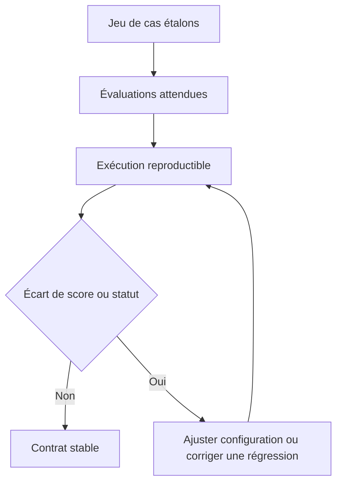
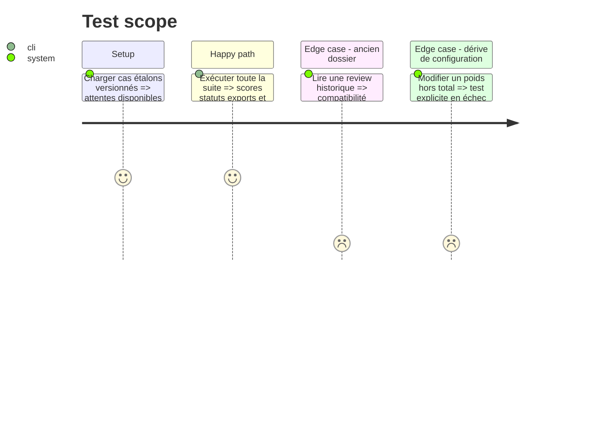

# Instruction: Compatibilité, cas étalons et documentation

## Architecture projection

> Tree of the final files. ✅ create · ✏️ modify · ❌ delete

```txt
.
├── README.md                               ✏️ nouveaux résultats et choix des exports
├── docs/
│   └── CV_ASSESSMENT.md                   ✅ schéma, limites et méthode de calibration
├── tests/
│   ├── fixtures/
│   │   └── cv_assessment_cases.json       ✅ cas forts, limites, hors cible et inconnus
│   ├── test_cv_assessment.py              ✏️ cas étalons et stabilité des scores
│   ├── test_cv_generator.py               ✏️ intégration complète et rétrocompatibilité
│   └── test_deployment_contract.py        ✏️ présence des dépendances et fichiers requis
└── cv_generator/
    └── pipeline.py                         ✏️ champs historiques dérivés pendant la transition
```

## User Journey



## Test Scope



## Tasks to do

### `1)` Construire un jeu d’étalonnage

> Évaluer le système sur des situations représentatives du profil.

1. Ajouter des annonces synthétiques webmaster, formateur, Symfony, accueil, logistique, hors cible et données insuffisantes.
2. Définir pour chaque cas les contrôles, la plage de score attendue et les expériences admissibles.
3. Vérifier que les expériences conditionnelles n’apparaissent que dans les cas pertinents.

### `2)` Garantir la migration

> Préserver les dossiers existants pendant l’adoption du nouveau contrat.

1. Dériver temporairement les anciens champs depuis la nouvelle évaluation.
2. Lire les anciennes reviews sans exiger `cv_assessment.json`.
3. Documenter la dépréciation et la condition de suppression ultérieure.

### `3)` Documenter les limites

> Éviter de présenter l’évaluation interne comme celle d’un ATS réel.

1. Expliquer la signification de chaque dimension et les seuils initiaux.
2. Documenter que les questions éliminatoires externes restent hors du PDF.
3. Décrire la calibration future avec réponses recruteurs et entretiens, sans déduire qu’un refus provient automatiquement de l’ATS.

### `4)` Vérifier la livraison complète

> Fermer le plan avec une validation reproductible.

1. Exécuter les tests Python ciblés puis complets.
2. Exécuter le lint et le build du frontend.
3. Générer un cas étalon et contrôler les deux PDF, les deux HTML, le JSON du CV, le JSON d’évaluation et la réponse du backend.

## Test acceptance criteria

| Task | Acceptance criteria |
| ---- | ------------------- |
| 1 | Le jeu étalon couvre au moins un cas fort, limite, hors cible, inconnu et chaque famille d’expérience conditionnelle. |
| 1 | Les scores restent dans les plages attendues et les statuts bloquants sont exacts sur deux exécutions successives. |
| 2 | Les dossiers historiques restent affichables et téléchargeables sans régénération. |
| 3 | La documentation qualifie explicitement les scores d’indicateurs internes et décrit leurs limites. |
| 4 | Les tests Python, le lint frontend et le build frontend réussissent. |
| 4 | Un cas de bout en bout produit une version ATS parseable, une version graphique et une évaluation affichable. |
| 4 | Les nouvelles générations ne produisent aucun fichier Markdown ou Canva. |
