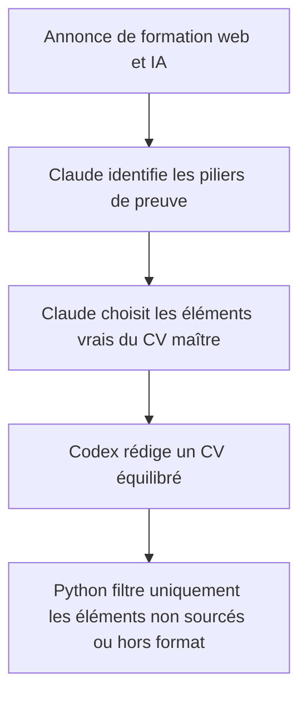
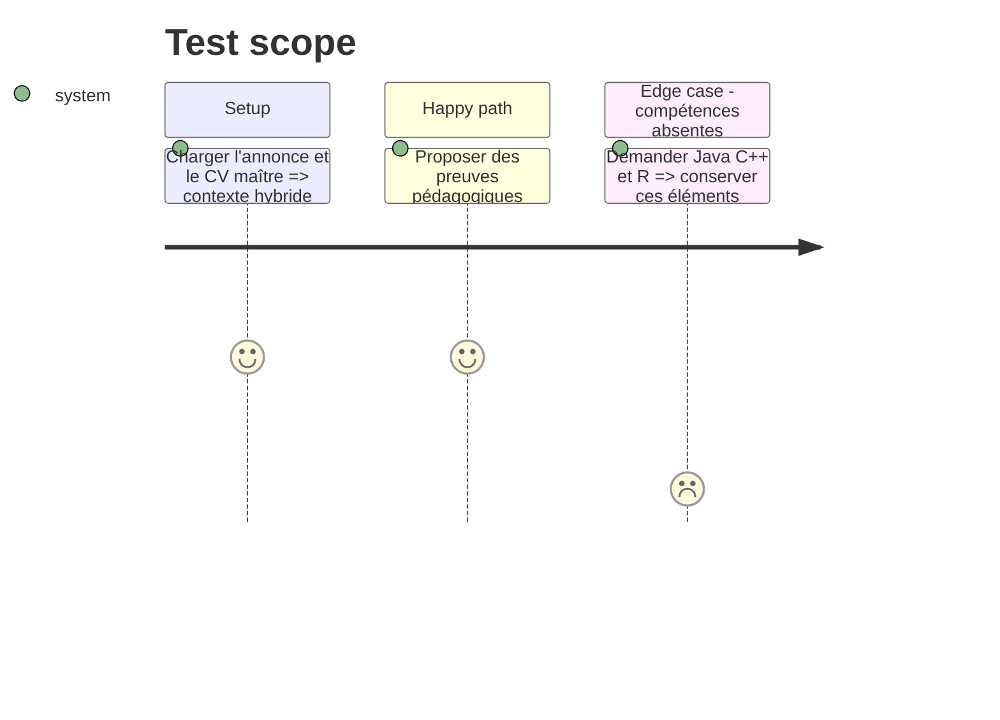

# Instruction: Donner aux agents un contrat éditorial hybride

## Architecture projection

> Tree of the final files. ✅ create · ✏️ modify · ❌ delete

```txt
job-search-automation-package/
├── cv_generator/
│   └── ai_agents.py                         ✏️ préciser les responsabilités éditoriales de l'analyse et de la rédaction
├── data/
│   └── cv_master_profile.json               ✏️ ajouter les recommandations configurables du profil formateur web/IA
└── tests/
    └── test_cv_generator.py                 ✏️ couvrir la sélection hybride sans expérience imposée par Python
```

## User Journey



## Test Scope



## Tasks to do

### `1)` Formaliser les trois piliers de preuve

> Donner à Claude une grille explicite pour les annonces combinant formation, développement et IA.

1. Décrire les piliers pédagogie, réalisation technique et IA dans les consignes de l'analyseur.
2. Demander une réalisation publique quand une preuve pertinente avec lien existe dans le CV maître.
3. Préciser que les identifiants Hélène, La Magicieuse, Pôle S ou Konexio restent des choix et non des obligations.

### `2)` Préserver le niveau réel des compétences

> Empêcher une liste de mots-clés de transformer des bases en maîtrise solide.

1. Faire utiliser `skills_confidence` par le rédacteur pour choisir une rubrique honnête.
2. Autoriser Python à refuser une compétence inconnue sans lui permettre d'en ajouter une.
3. Ne jamais ajouter Java, C++ ou R tant qu'ils ne figurent pas dans la source de vérité.

### `3)` Construire un récit lisible

> Présenter les expériences retenues dans un ordre cohérent et conserver une preuve projet utile.

1. Demander un ordre antéchronologique après la sélection de pertinence.
2. Conserver trois à quatre expériences couvrant les piliers sans remplir artificiellement la page.
3. Demander une stack DevDoc représentative de l'annonce plutôt qu'une technologie isolée.

## Test acceptance criteria

| Task | Acceptance criteria |
| ---- | ------------------- |
| 1 | Pour une annonce web/IA, le plan IA peut retenir Pôle S, Qualiscope, Hélène et Konexio et peut choisir une autre combinaison sourcée si elle couvre mieux les trois piliers. |
| 2 | Le CV ne contient ni Java, ni C++, ni R et ne présente pas Python ou Node.js comme une maîtrise supérieure au niveau enregistré. |
| 3 | Les expériences sont lisibles dans un ordre cohérent et DevDoc conserve plusieurs technologies pertinentes lorsque l'annonce couvre le développement web au sens large. |
