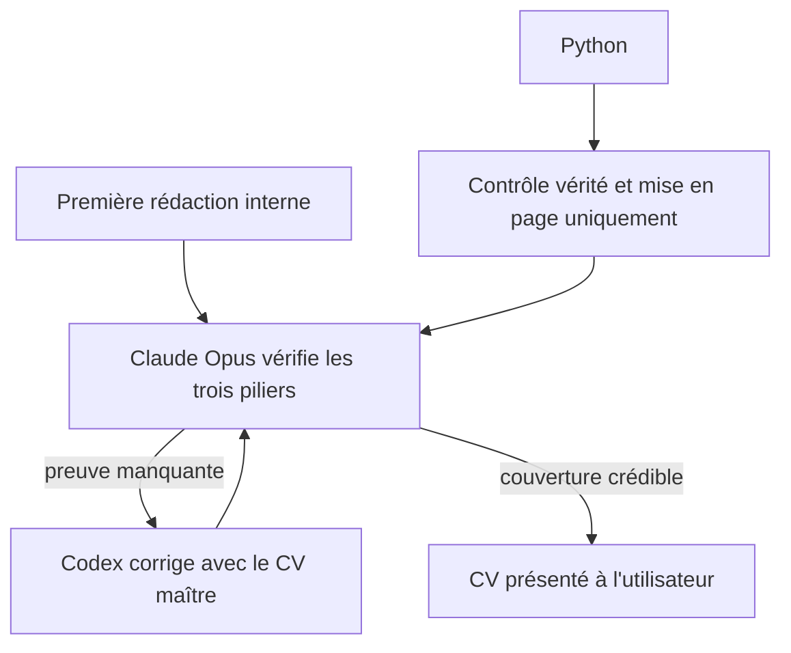
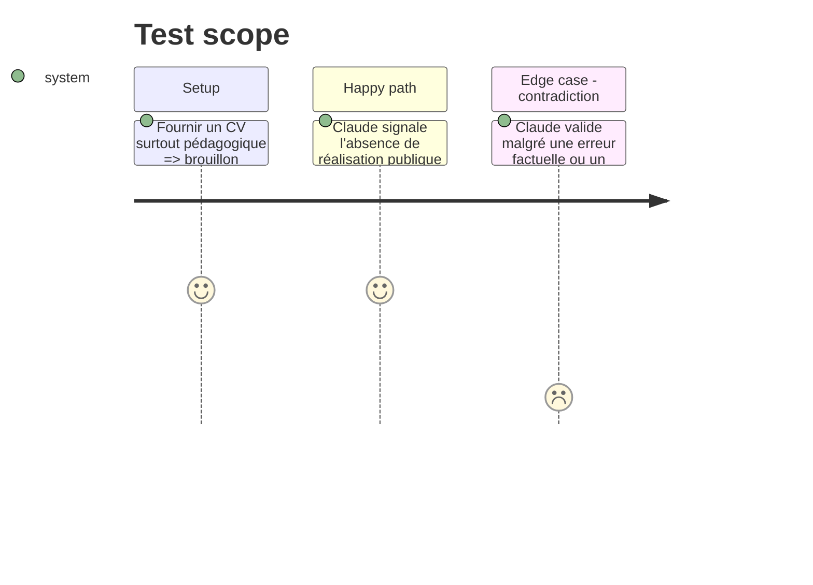

# Instruction: Faire juger et corriger la couverture des preuves

## Architecture projection

> Tree of the final files. ✅ create · ✏️ modify · ❌ delete

```txt
job-search-automation-package/
├── cv_generator/
│   └── ai_agents.py                         ✏️ structurer le diagnostic de Claude Opus et les corrections Codex
├── cv_generator/
│   └── pipeline.py                          ✏️ tracer la couverture décidée par le juge sans calcul éditorial Python
└── tests/
    └── test_cv_generator.py                 ✏️ vérifier verdict IA, correction automatique et garde-fous
```

## User Journey



## Test Scope



## Tasks to do

### `1)` Structurer la couverture du juge

> Rendre explicite ce que Claude considère couvert ou manquant.

1. Ajouter au jugement une couverture structurée des piliers pédagogie, réalisation technique, IA et preuve publique.
2. Relier chaque preuve à un identifiant d'expérience ou de projet existant.
3. Laisser à Claude les scores et le verdict de pertinence.

### `2)` Corriger automatiquement avant présentation

> Utiliser le diagnostic structuré dans les tours de révision existants.

1. Faire lire la couverture au réviseur Codex.
2. Autoriser l'ajout, le retrait et le réordonnancement de tout élément sourcé.
3. Faire rejuger chaque correction par Claude Opus jusqu'à validation ou limite de sécurité.

### `3)` Conserver les garde-fous techniques

> Maintenir la fiabilité sans redonner la décision éditoriale à Python.

1. Valider les identifiants, indices de preuves, dates, liens et compétences contre le CV maître.
2. Contrôler la longueur, le nombre d'éléments et les débordements.
3. Ne pas convertir les heuristiques de mots-clés Python en verdict final.

## Test acceptance criteria

| Task | Acceptance criteria |
| ---- | ------------------- |
| 1 | Le jugement indique séparément si pédagogie, réalisation technique, IA et preuve publique sont couvertes et cite des éléments sourcés. |
| 2 | Un brouillon sans réalisation concrète est corrigé automatiquement avec une expérience pertinente avant d'être présenté. |
| 3 | Un choix éditorial de Claude n'est pas annulé par Python, mais une date, compétence ou URL inconnue est rejetée. |
