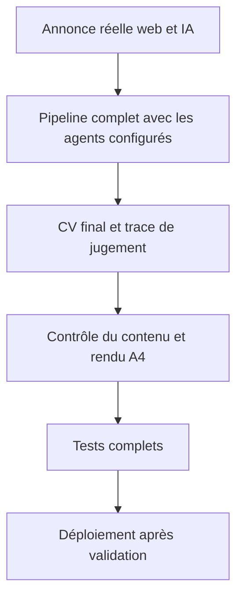
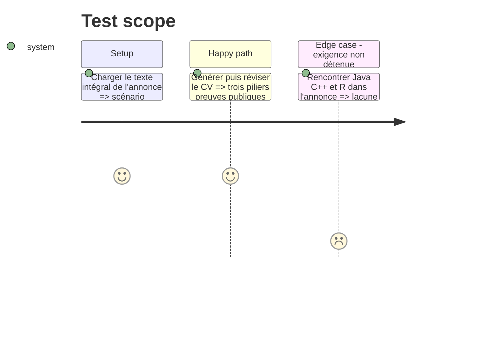

# Instruction: Valider sur l'annonce réelle et préparer le déploiement

## Architecture projection

> Tree of the final files. ✅ create · ✏️ modify · ❌ delete

```txt
job-search-automation-package/
├── tests/
│   └── test_cv_generator.py                 ✏️ ajouter l'annonce réelle comme scénario de non-régression
├── cv_generator/
│   └── exporters.py                         ✏️ uniquement si la composition validée révèle un défaut de mise en page
└── data/
    └── cv_master_profile.json               ✏️ synchroniser les données validées avec le serveur après sauvegarde
```

## User Journey



## Test Scope



## Tasks to do

### `1)` Ajouter le scénario de non-régression

> Reproduire l'annonce qui a révélé le défaut.

1. Utiliser le texte intégral de l'annonce comme fixture de test.
2. Vérifier la présence d'une preuve pédagogique, d'une réalisation technique, d'un usage IA et d'un lien public.
3. Vérifier l'absence de Java, C++ et R dans le CV produit.

### `2)` Contrôler le document final

> Vérifier le fond et la forme avant déploiement.

1. Générer un PDF de contrôle avec la pipeline complète.
2. Vérifier visuellement l'absence de débordement, l'ordre des expériences et la lisibilité des liens.
3. Examiner la trace pour confirmer que Claude a jugé et que Codex a appliqué les corrections nécessaires.

### `3)` Livrer sans désaligner le serveur

> Déployer seulement la version vérifiée.

1. Exécuter toute la suite de tests et les contrôles de format.
2. Committer et pousser le code validé sur la branche de production.
3. Sauvegarder puis synchroniser le CV maître sur le serveur et vérifier le conteneur après redéploiement.

## Test acceptance criteria

| Task | Acceptance criteria |
| ---- | ------------------- |
| 1 | Le scénario réel échoue si le CV ne couvre qu'une seule dimension du poste ou invente une compétence absente. |
| 2 | Le PDF final tient sur une page A4, contient des liens lisibles et ne présente aucun chevauchement ou texte coupé. |
| 3 | Les tests passent, le code local et distant correspondent et la donnée serveur correspond au CV maître validé. |
