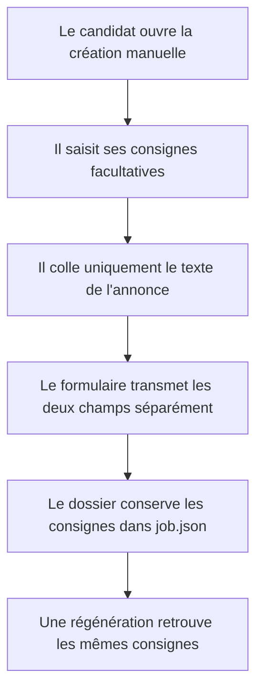
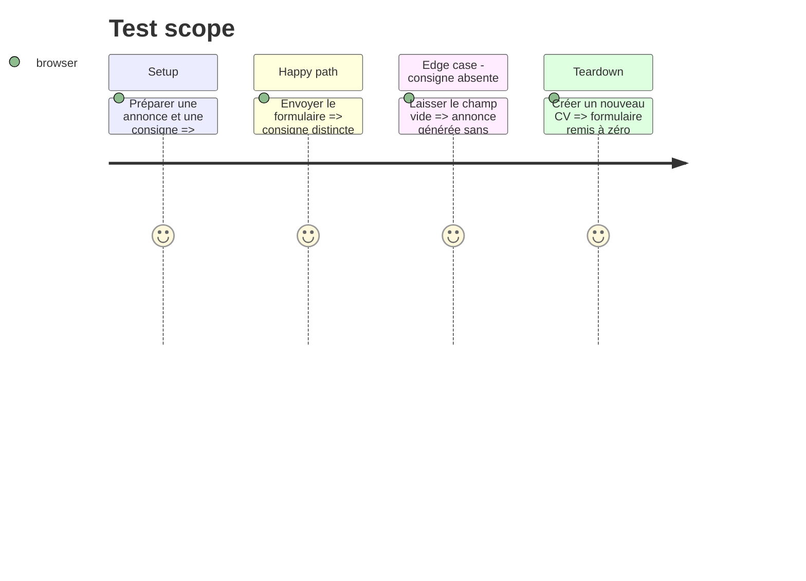

# Instruction: Saisie et persistance des consignes

## Architecture projection

> Tree of the final files. ✅ create · ✏️ modify · ❌ delete

```txt
.
├── front/src/ManualCvView.jsx              ✏️ champ et payload
├── front/src/App.css                       ✏️ présentation du champ
├── tests/test_application_builder.py       ✏️ persistance dans job.json
└── tests/test_deployment_contract.py       ✏️ contrat du formulaire déployé
```

## User Journey



## Test Scope



## Wireframe

```txt
┌──────────────────────────────────────────────┐
│ (1) Informations du poste                   │
├──────────────────────────────────────────────┤
│ (2) Consignes personnelles facultatives     │
│     [ zone de texte courte ]                │
├──────────────────────────────────────────────┤
│ (3) Texte complet de l'annonce              │
│     [ grande zone de texte ]                │
├──────────────────────────────────────────────┤
│ (4) Action de génération                    │
└──────────────────────────────────────────────┘
```

1. Informations du poste : champs structurés déjà présents.
2. Consignes : préférences du candidat, séparées de l'annonce.
3. Annonce : texte de l'employeur uniquement.
4. Action : lance la chaîne de génération existante.

## Tasks to do

### `1)` Ajouter le champ au formulaire

> Recueillir une consigne facultative sans modifier la saisie de l'annonce.

1. Ajouter `candidate_instructions` à l'état initial.
2. Afficher une zone de texte courte avant l'annonce.
3. Donner à son placeholder une couleur dédiée et lisible.
4. Transmettre la valeur nettoyée dans l'objet `job`.

### `2)` Verrouiller la persistance

> Garantir que la consigne survive à la préparation et à la régénération.

1. Vérifier son écriture dans `job.json`.
2. Couvrir le contrat du formulaire et sa remise à zéro.

## Test acceptance criteria

| Task | Acceptance criteria |
| ---- | ------------------- |
| 1 | Le formulaire expose un champ facultatif distinct et le payload contient `candidate_instructions`. |
| 2 | Le dossier créé conserve exactement la consigne et la régénération peut la relire. |
