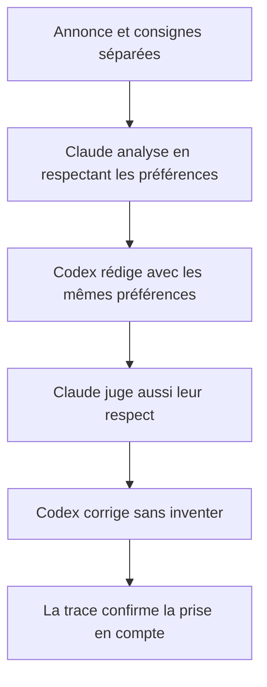
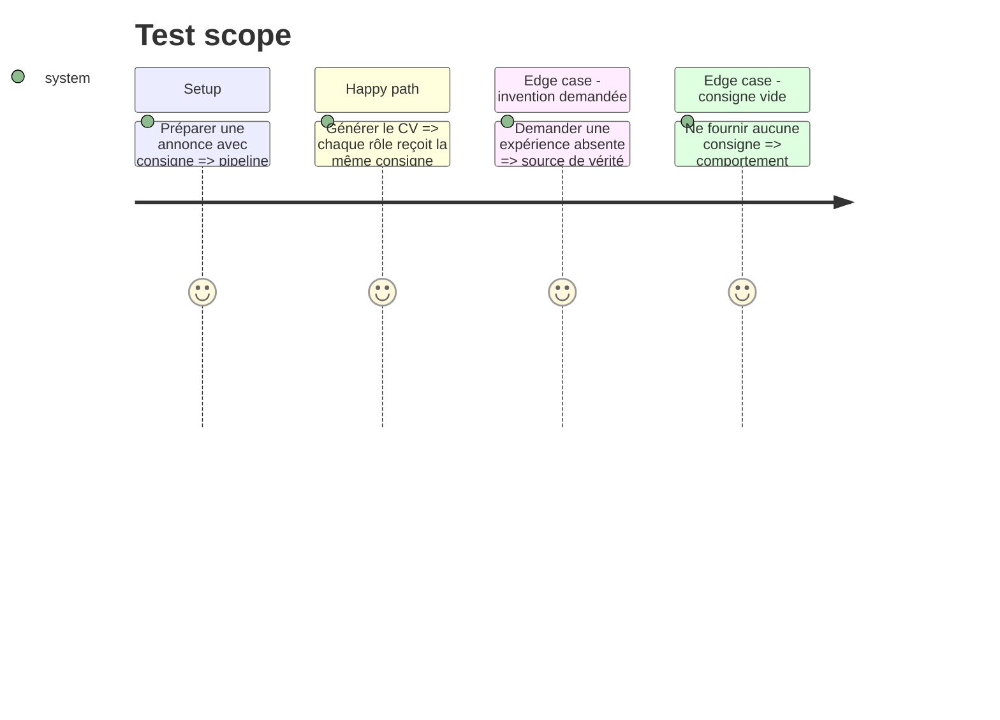

# Instruction: Contrat IA, traçabilité et validation

## Architecture projection

> Tree of the final files. ✅ create · ✏️ modify · ❌ delete

```txt
.
├── cv_generator/ai_agents.py                 ✏️ consigne séparée dans quatre rôles IA
├── cv_generator/pipeline.py                  ✏️ trace non sensible de la présence des consignes
└── tests/test_cv_generator.py                ✏️ propagation et garde-fous
```

## User Journey



## Test Scope



## Tasks to do

### `1)` Définir le contrat des consignes

> Donner aux agents une priorité éditoriale explicite et sûre.

1. Nettoyer et limiter la longueur des consignes.
2. Les transmettre sous `consignes_candidat` à l'analyseur, au rédacteur, au juge et au réviseur.
3. Préciser dans les prompts qu'elles ne peuvent jamais contourner le CV maître.

### `2)` Rendre la prise en compte vérifiable

> Vérifier la propagation sans recopier le texte privé dans les traces.

1. Exposer seulement la présence et le nombre de caractères dans la trace.
2. Tester tous les appels IA et le comportement sans consigne.
3. Exécuter les tests Python, le lint et le build du front.

## Test acceptance criteria

| Task | Acceptance criteria |
| ---- | ------------------- |
| 1 | Les quatre rôles reçoivent les consignes dans une clé distincte et leurs prompts imposent la vérité du CV maître. |
| 2 | La trace indique la prise en compte sans révéler le texte et toutes les validations passent. |
