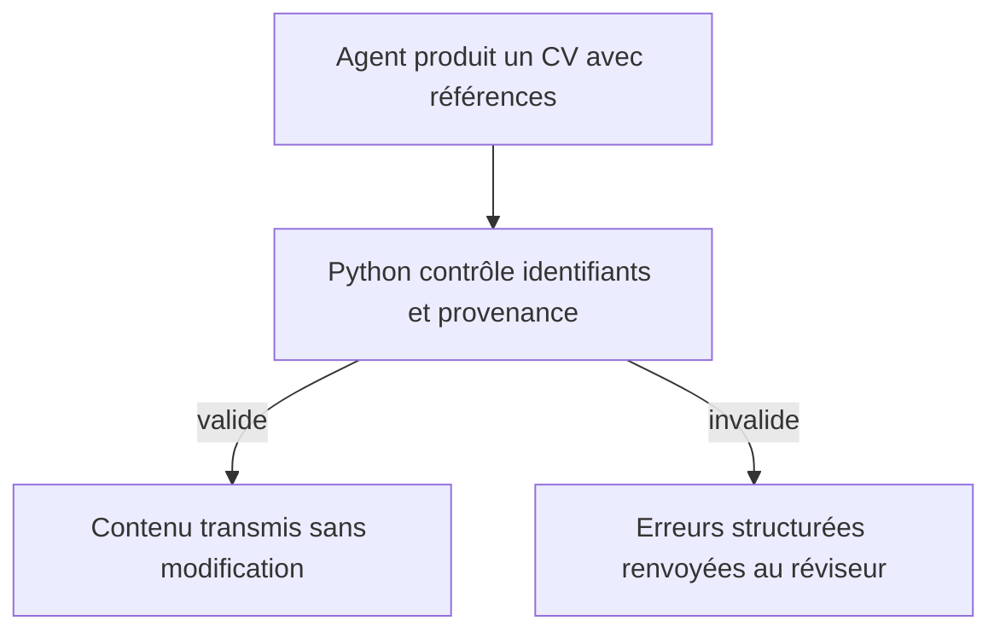
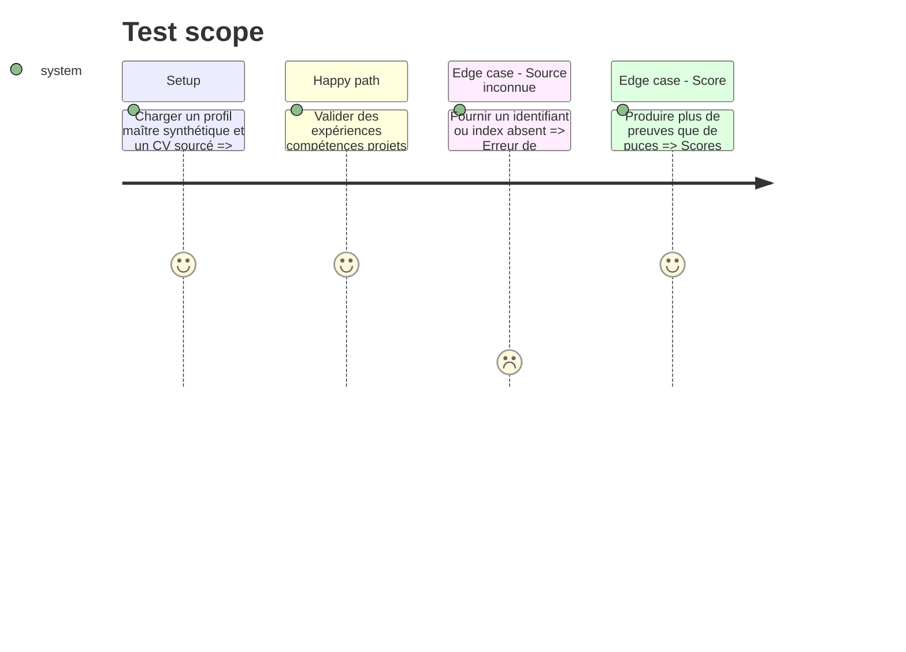

# Instruction: Contrat de provenance et validations non modificatrices

## Architecture projection

> Tree of the final files. ✅ create · ✏️ modify · ❌ delete

```txt
.
├── cv_generator/
│   ├── ✅ cv_truth_validator.py
│   ├── ✏️ ai_agents.py
│   ├── ✏️ cv_assessment.py
│   └── ✏️ cv_quality_checker.py
└── tests/
    ├── ✅ fixtures/careco_cv_case.json
    ├── ✅ test_cv_truth_validator.py
    └── ✏️ test_cv_assessment.py
```

## User Journey



## Test Scope



## Tasks to do

### `1)` Définir le contrat éditorial sourcé

> Rendre chaque choix IA vérifiable sans reconstruire le CV.

1. Définir les objets expérience individuelle, expérience groupée, puce, projet, compétence et formation.
2. Exiger des références `experience_id:index` ou `project_id` pour chaque affirmation reformulée.
3. Distinguer les erreurs bloquantes de vérité des avertissements éditoriaux.

### `2)` Extraire le validateur de vérité

> Centraliser les contrôles Python dans une fonction pure et non modificatrice.

1. Vérifier identifiants, dates, organisations, intitulés, compétences autorisées et indices de preuve.
2. Vérifier les affirmations interdites et les limites structurelles.
3. Retourner le contenu original et une liste d'erreurs; ne jamais ajouter de fallback.

### `3)` Fiabiliser l'évaluation

> Produire des statuts et scores cohérents.

1. Utiliser les membres sourcés des groupes pour mesurer la couverture.
2. Plafonner chaque composant et score global entre 0 et 100.
3. Faire échouer la véracité dès qu'une référence est absente ou incohérente.

## Test acceptance criteria

| Task | Acceptance criteria |
| ---- | ------------------- |
| 1 | Un CV groupé peut citer plusieurs expériences et plusieurs preuves par puce avec un schéma unique documenté par les tests. |
| 2 | Le validateur accepte un contenu exact sans changer son ordre ni son texte, et refuse précisément toute source inconnue. |
| 3 | Aucun score ne dépasse 100 et les expériences groupées comptent leurs membres réels dans la couverture. |
