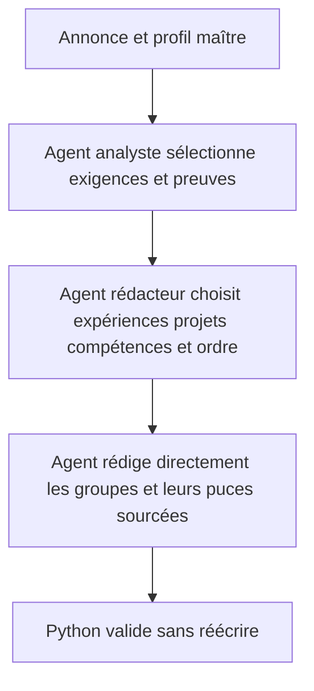
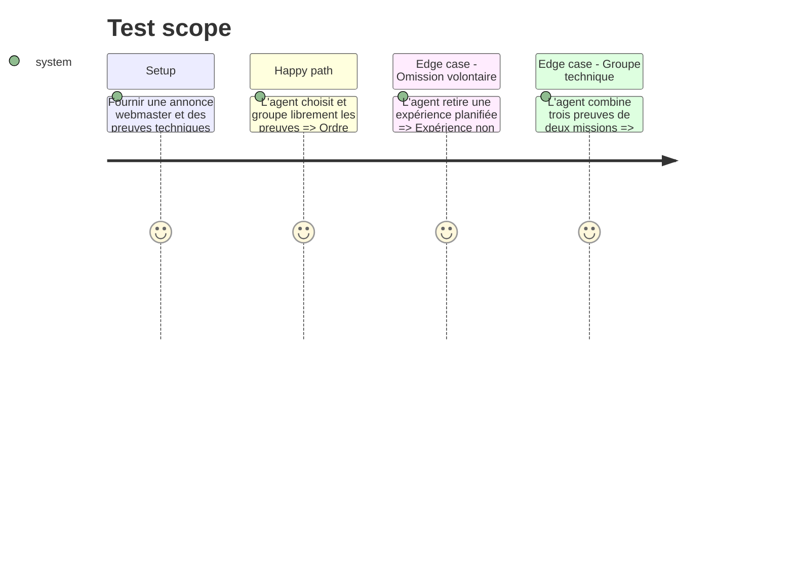

# Instruction: Composition et regroupement pilotés par les agents

## Architecture projection

> Tree of the final files. ✅ create · ✏️ modify · ❌ delete

```txt
.
├── cv_generator/
│   ├── ✏️ ai_agents.py
│   ├── ✏️ cv_creator.py
│   └── ✏️ job_analyzer.py
├── config/
│   └── ✏️ ai_role_routing.json
└── tests/
    └── ✏️ test_cv_generator.py
```

## User Journey



## Test Scope



## Tasks to do

### `1)` Rendre le plan IA consultatif

> Le plan propose des preuves sans devenir une liste imposée.

1. Retirer le nombre minimum d'expériences et les réinsertions automatiques.
2. Retirer les préférences métier codées en dur de la sélection Python.
3. Fournir à l'analyste le catalogue complet utile et enregistrer ses justifications.

### `2)` Donner le dernier mot au rédacteur

> Préserver exactement la sélection et l'ordre retournés par l'agent.

1. Supprimer l'ajout automatique d'expériences et de projets absents de la réponse.
2. Ne plus trier les expériences après la réponse; demander et vérifier l'ordre chronologique dans la revue.
3. Ne plus fabriquer de puces de secours lorsqu'une expérience est vide; retourner une erreur de contrat.

### `3)` Remplacer le regroupement déterministe

> Faire des groupes une sortie éditoriale native de l'agent.

1. Autoriser les objets groupés avec `source_experience_ids` et sources par puce.
2. Supprimer la règle « première puce de chaque mission » de `apply_experience_presentation`.
3. Limiter Python à la validation des membres, des sources et des contraintes de longueur.

## Test acceptance criteria

| Task | Acceptance criteria |
| ---- | ------------------- |
| 1 | Une expérience non choisie par l'agent n'apparaît plus dans le CV, même si le plan déterministe la proposait. |
| 2 | Python conserve l'ordre, les compétences et les projets choisis par l'agent sans fallback éditorial. |
| 3 | Le cas CARECO conserve simultanément WooCommerce ou API REST et Twig/Bootstrap/Git dans le groupe La Magicieuse–Qualiscope. |
