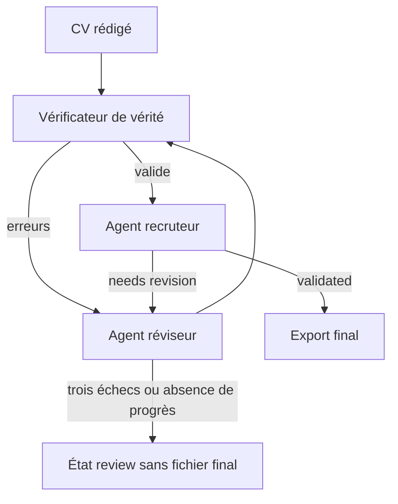
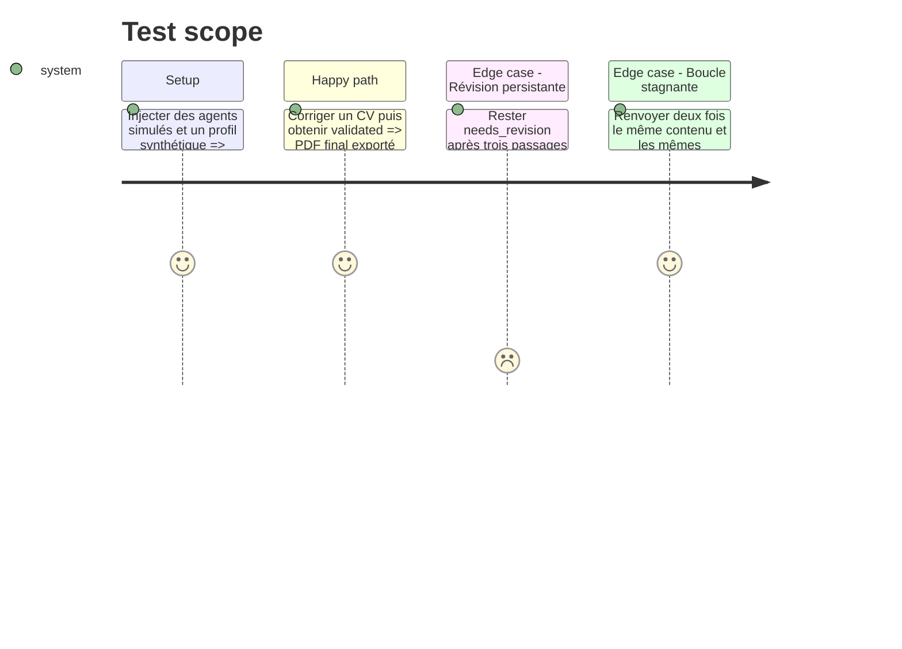

# Instruction: Double vérification, révisions bornées et verrou d'export

## Architecture projection

> Tree of the final files. ✅ create · ✏️ modify · ❌ delete

```txt
.
├── cv_generator/
│   ├── ✏️ ai_agents.py
│   ├── ✏️ pipeline.py
│   ├── ✏️ exporters.py
│   └── ✏️ ats_exporter.py
├── config/
│   └── ✏️ ai_role_routing.json
└── tests/
    └── ✏️ test_cv_generator.py
```

## User Journey



## Test Scope



## Tasks to do

### `1)` Séparer vérité et pertinence

> Éviter qu'un score éditorial masque une erreur factuelle.

1. Faire exécuter le validateur Python avant tout jugement éditorial.
2. Ajouter un agent vérificateur de vérité qui peut uniquement accepter ou refuser les affirmations sourcées.
3. Conserver le juge recruteur pour pertinence, lisibilité, couverture et ATS.

### `2)` Piloter les corrections

> Donner au réviseur toutes les erreurs actionnables.

1. Fusionner les erreurs de vérité, de pertinence et de rendu dans un contrat de correction unique.
2. Autoriser trois révisions maximum avec arrêt dès `validated`.
3. Détecter l'absence de progrès par empreinte du contenu et des problèmes.

### `3)` Verrouiller l'export final

> Ne publier que les CV réellement acceptés.

1. Produire les JSON de diagnostic à chaque passage.
2. Réserver `cv_final.html`, `cv_final.pdf` et `cv_ats.pdf` au statut `ready`.
3. En cas de révision persistante, produire au plus des artefacts explicitement nommés `cv_review_preview.*`.

## Test acceptance criteria

| Task | Acceptance criteria |
| ---- | ------------------- |
| 1 | Une invention bloque avant le juge recruteur et une faiblesse éditoriale n'altère jamais les données sources. |
| 2 | Le pipeline effectue jusqu'à trois corrections, s'arrête sur validation et trace chaque passage. |
| 3 | Aucun fichier portant `cv_final` n'est créé ou remplacé lorsque le dernier verdict reste `needs_revision`. |
