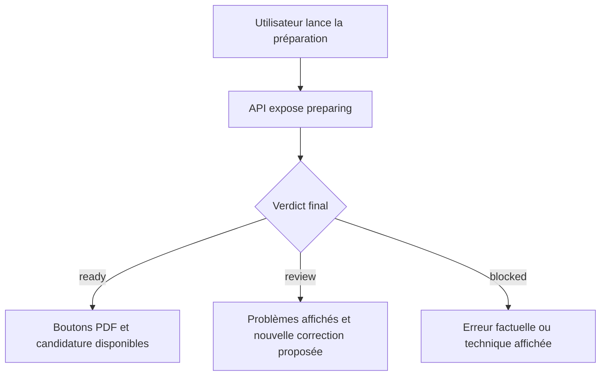
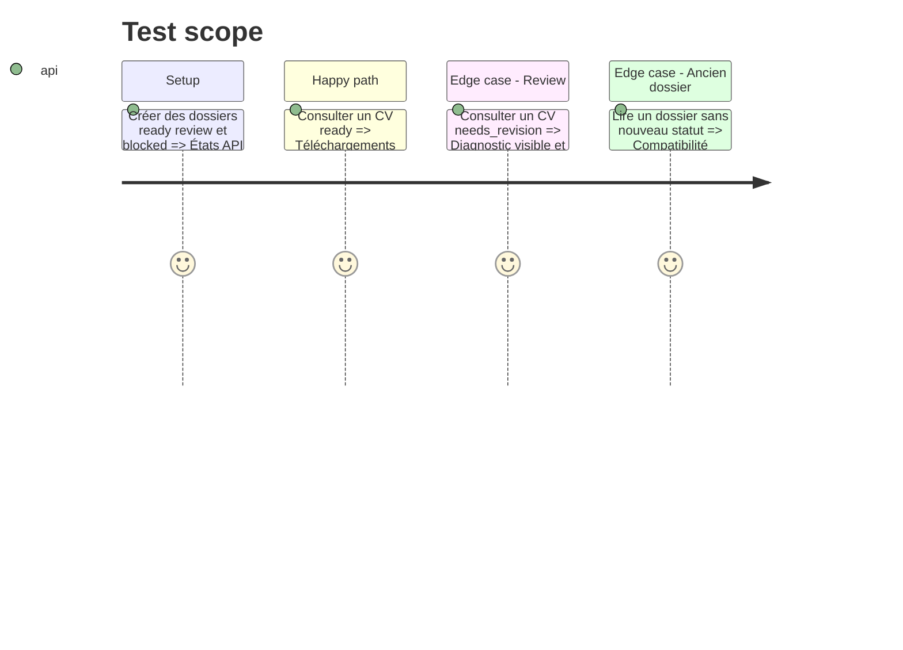

# Instruction: Propagation des statuts dans l'API et le frontend

## Architecture projection

> Tree of the final files. ✅ create · ✏️ modify · ❌ delete

```txt
.
├── server/
│   ├── ✏️ routes/applications.js
│   ├── ✏️ repositories/jsonApplicationsRepository.js
│   └── ✏️ services/cvDownloads.js
├── front/src/
│   └── ✏️ App.jsx
└── tests/
    ├── ✏️ test_candidatures_index.py
    └── ✅ test_cv_publication_contract.py
```

## User Journey



## Test Scope



## Tasks to do

### `1)` Stabiliser le contrat de publication

> Distinguer préparation technique, validation éditoriale et disponibilité des fichiers.

1. Exposer `preparing`, `review`, `ready` et `blocked` avec leur cause.
2. Ne déclarer `ready` que si l'évaluation et les fichiers finaux concordent.
3. Conserver une lecture prudente des dossiers historiques.

### `2)` Protéger les téléchargements et l'envoi

> Empêcher l'utilisation d'un CV refusé.

1. Refuser le téléchargement final si le statut n'est pas `ready`.
2. Ne jamais proposer l'envoi pour `review` ou `blocked`.
3. Exposer les aperçus de révision sous des noms non ambigus.

### `3)` Rendre le statut compréhensible

> Montrer pourquoi un CV n'est pas final.

1. Afficher les problèmes bloquants et le nombre de révisions effectuées.
2. Distinguer un écart honnête non réparable d'une preuve disponible mais sous-utilisée.
3. Conserver le polling mobile existant.

## Test acceptance criteria

| Task | Acceptance criteria |
| ---- | ------------------- |
| 1 | L'API ne confond jamais un dossier techniquement généré avec un CV éditorialement validé. |
| 2 | Un CV `review` ne peut être ni téléchargé comme final ni utilisé pour une candidature. |
| 3 | Le frontend explique la cause du statut et continue de suivre correctement une préparation asynchrone. |
