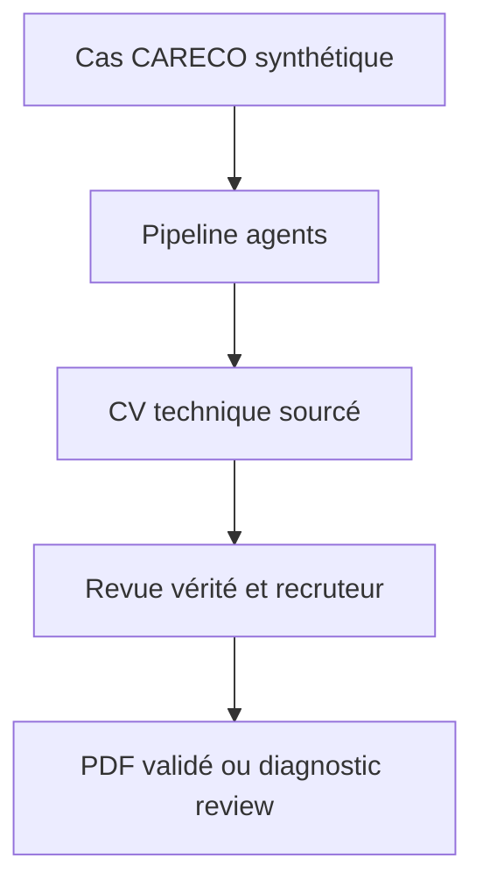
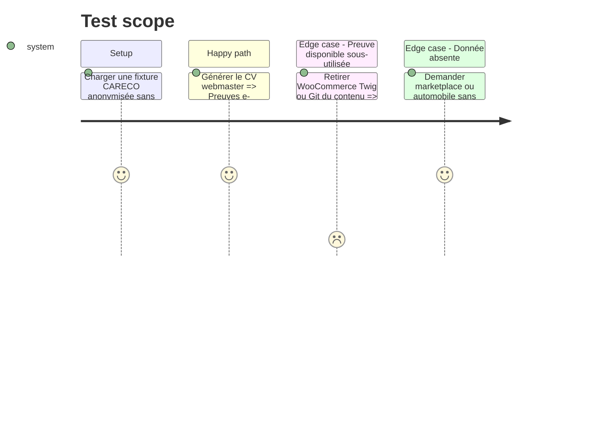

# Instruction: Non-régression CARECO et assainissement des anciens garde-fous

## Architecture projection

> Tree of the final files. ✅ create · ✏️ modify · ❌ delete

```txt
.
├── cv_generator/
│   ├── ✏️ ai_agents.py
│   ├── ✏️ cv_creator.py
│   ├── ✏️ job_analyzer.py
│   └── ✏️ pipeline.py
├── tests/
│   ├── ✏️ fixtures/careco_cv_case.json
│   ├── ✏️ test_cv_generator.py
│   └── ✏️ test_cv_assessment.py
└── docs/
    └── ✅ AGENT_OWNED_CV_PIPELINE.md
```

## User Journey



## Test Scope



## Tasks to do

### `1)` Écrire la non-régression CARECO

> Reproduire le défaut sans copier le profil personnel dans Git.

1. Créer une fixture synthétique reprenant uniquement la structure et des preuves fictives équivalentes.
2. Vérifier qu'au moins une preuve e-commerce, une preuve maintenance/stack et une preuve support sont visibles.
3. Vérifier que marketplace, comptabilité automobile et anglais professionnel ne sont jamais inventés.

### `2)` Supprimer les chemins éditoriaux morts

> Éviter le retour discret du générateur Python.

1. Retirer les helpers de regroupement, remplissage et sélection devenus inutilisés.
2. Retirer les tests qui imposent des expériences ou projets précis à la place des agents.
3. Conserver et renforcer les tests de vérité, de format et de publication.

### `3)` Documenter les responsabilités

> Rendre la frontière IA/Python durable.

1. Documenter les cinq agents, leurs entrées, sorties et droits.
2. Documenter les validations Python et l'interdiction de mutation éditoriale.
3. Documenter les statuts, les artefacts de diagnostic et les conditions de publication.

## Test acceptance criteria

| Task | Acceptance criteria |
| ---- | ------------------- |
| 1 | La fixture CARECO échoue avec l'ancien regroupement et passe avec la composition agent, sans donnée personnelle versionnée. |
| 2 | Aucun helper Python restant ne sélectionne, ajoute, regroupe ou réordonne une expérience, un projet ou une compétence. |
| 3 | La documentation permet d'identifier sans ambiguïté qui décide, qui vérifie et qui autorise l'export. |
