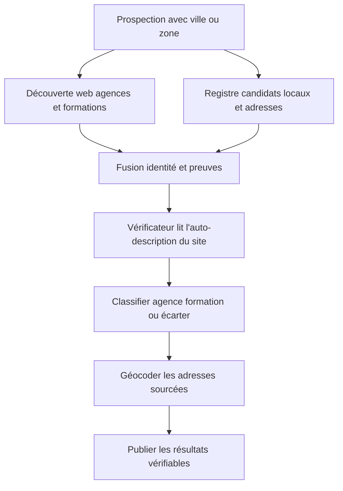
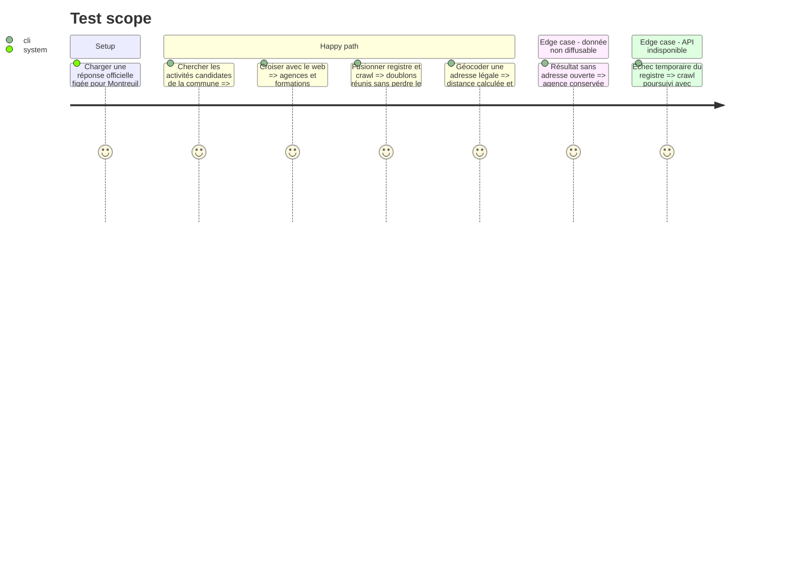

# Instruction: Découverte hybride, adresses officielles et barème fiable

## Architecture projection

> Tree of the final files. ✅ create · ✏️ modify · ❌ delete

```txt
.
├── tools/
│   ├── ✏️ agency_prospecting_v2.py
│   └── ✅ agency_registry.py
├── company_analysis/
│   └── ✏️ verifier.py
├── config/
│   └── ✏️ agent_verificateur.md
├── docs/
│   └── ✏️ AGENCIES_SCHEMA.md
└── tests/
    ├── ✏️ test_agency_prospecting.py
    └── ✅ fixtures/agency_registry_montreuil.json
```

## User Journey



## Test Scope



## Tasks to do

### `1)` Créer le client du registre public

> Interroger l'API ouverte avec des limites et des réponses testables.

1. Encapsuler URL, timeout, pagination, cadence maximale et erreurs HTTP.
2. Rechercher par commune/code postal et codes NAF web/formation configurables, sans secret.
3. Normaliser nom, SIREN, SIRET, activité, état administratif et adresse légale.
4. Marquer chaque résultat comme `candidate` : ni le code APE ni l'adresse légale ne prouvent l'activité réelle ni l'appartenance d'un site.

### `2)` Maintenir la découverte hybride et les deux catégories

> Croiser les moteurs et le registre sans faire de l'unique source un oracle.

1. Conserver les requêtes web et racines connues pour `agence` et `formation`.
2. Ajouter les candidats du registre au même pipeline sans leur attribuer automatiquement un domaine.
3. Faire confirmer l'activité par l'auto-description du site via le Vérificateur existant.
4. Produire explicitement `agence`, `formation`, `incertain` ou `ecarte`, avec preuves et motif.

### `3)` Fusionner registre, crawl et CSV

> Construire une agence unique sans confondre preuve administrative et preuve web.

1. Dédoublonner d'abord par SIREN/SIRET, puis domaine, puis nom normalisé avec signaler les rapprochements incertains.
2. Donner priorité au CSV versionné pour une correction humaine, puis au registre pour l'adresse légale, puis au site pour l'adresse publiée.
3. Ajouter `siren`, `siret`, `legal_address`, `legal_address_source` et `identity_match` au schéma.
4. Ne jamais attribuer le site d'une agence à une société si le rapprochement reste incertain.

### `4)` Calculer la distance avec cache

> Obtenir les kilomètres sans répéter les appels de géocodage.

1. Mettre en cache les coordonnées par adresse normalisée dans `data/`.
2. Calculer `distance_m` depuis l'origine configurée et distinguer adresse légale, adresse du site et approximation.
3. Respecter la règle : aucune adresse ne peut être déduite d'un code postal seul.

### `5)` Verrouiller les contrats

> Tester sans réseau les règles anti-invention et les limites de l'API.

1. Utiliser une fixture officielle anonymisée/minimale.
2. Couvrir pagination, limite de débit, fusion, conflit d'identité et indisponibilité.
3. Mettre à jour la documentation du schéma et des sources.

### `6)` Corriger le barème déterministe

> Faire du score une présélection utile sans le confondre avec un jugement.

1. Exclure explicitement SaaS, plateformes et annuaires ; ne jamais exclure une formation vérifiée au seul motif qu'elle n'est pas une agence.
2. Corriger les correspondances par sous-chaîne ambiguës, notamment `nation` dans `international`.
3. Éviter la saturation à 100 en plafonnant les familles de signaux redondants.
4. Plafonner séparément les familles agence et formation avant le jugement du Vérificateur.
5. Conserver le détail des signaux positifs, négatifs et d'exclusion dans le payload.

## Test acceptance criteria

| Task | Acceptance criteria |
| ---- | ------------------- |
| 1 | Une recherche de fixture Montreuil retourne des candidats actifs avec identifiants et provenance, sans les présenter comme agences confirmées sur le seul code APE. |
| 2 | Les fixtures Access42/Simplon restent dans `formation`, une vraie agence reste dans `agence` et Studio Bleu n'est pas validé par son seul APE. |
| 3 | Un même établissement présent dans le registre, le crawl et le CSV produit une seule entrée ; un rapprochement incertain n'invente aucun domaine. |
| 4 | Deux runs sur les mêmes adresses réutilisent le cache et produisent les mêmes distances sans nouvel appel de géocodage. |
| 5 | La suite hors ligne prouve qu'une adresse absente reste absente et qu'une panne de l'API n'efface pas les résultats du crawl. |
| 6 | Les fixtures Webflow/Livementor/annuaire sont écartées, Access42/Simplon restent éligibles, `international` ne valide pas Nation et les signaux redondants ne saturent plus le score. |
