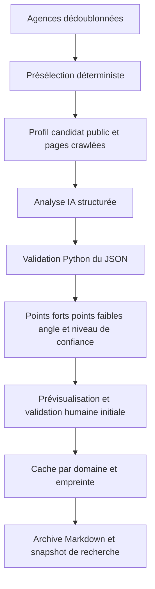
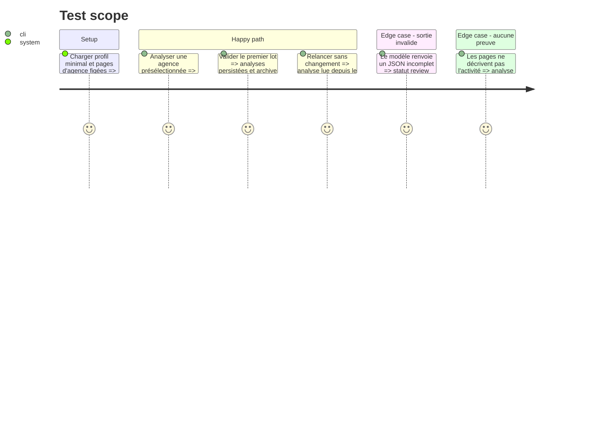

# Instruction: Points forts, points faibles et angle de candidature

## Architecture projection

> Tree of the final files. ✅ create · ✏️ modify · ❌ delete

```txt
.
├── agency_analysis/
│   ├── ✅ __init__.py
│   └── ✅ fit_analyzer.py
├── config/
│   └── ✏️ ai_role_routing.json
├── tools/
│   └── ✏️ agency_prospecting_v2.py
├── data/
│   └── ✅ agency_analyses.json
├── output/agencies/
│   └── ✅ analyses-<timestamp>.md
├── docs/
│   └── ✏️ AGENCIES_SCHEMA.md
└── tests/
    └── ✅ test_agency_fit_analyzer.py
```

## User Journey



## Test Scope



## Tasks to do

### `1)` Définir le contrat d'analyse

> Produire un jugement utile mais toujours relié aux éléments observés.

1. Définir les champs `strengths`, `weaknesses`, `application_angle`, `fit_summary`, `fit_score`, `confidence`, `category` et `evidence_urls`.
2. Interdire toute affirmation sur l'agence ou le candidat absente des entrées.
3. Charger le profil depuis la configuration existante sans publier le profil maître dans les sorties.
4. Adapter le jugement au positionnement : développement/webmaster pour une agence, formateur/RGAA/accompagnement pour une formation, sans forcer un rôle full-stack.

### `2)` Ajouter le rôle IA d'adéquation agence

> Réutiliser le routage et les replis déjà employés par les analyseurs du projet.

1. Ajouter un rôle dédié dans `config/ai_role_routing.json`.
2. Envoyer seulement les pages utiles, les métadonnées vérifiées et le profil nécessaire.
3. Valider et normaliser la réponse en Python ; classer les sorties invalides en `review`.

### `3)` Borner le coût et la durée

> Ne pas analyser indistinctement tous les domaines crawlés.

1. Lancer l'IA après dédoublonnage, exclusion dure des plateformes/annuaires et seuils distincts agence/formation.
2. Ajouter une limite configurable et un mode `--no-ai`.
3. Mettre en cache selon l'empreinte du profil, des pages et de la version du prompt.
4. Publier progression, nombre d'analyses, cache hits et erreurs dans le résultat de tâche.

### `4)` Persister et archiver les analyses

> Faire survivre le jugement aux nouveaux runs sans perdre son contexte.

1. Écrire `data/agency_analyses.json` atomiquement, indexé par domaine normalisé et empreinte des entrées ; ce fichier runtime reste hors Git et doit être couvert par le volume persistant du déploiement.
2. Ne jamais supprimer une analyse parce qu'une agence est absente du run suivant ; la marquer obsolète lorsque son empreinte change.
3. Produire une archive Markdown horodatée sous `output/agencies/`, sans chemin poste codé en dur.
4. Pour le premier lot et toute migration, montrer le contenu avant écriture et exiger une validation humaine.
5. Prévoir la copie du verdict retenu dans le snapshot immuable de la recherche de phase 3.

## Test acceptance criteria

| Task | Acceptance criteria |
| ---- | ------------------- |
| 1 | Chaque point fort ou faible contient une preuve identifiable, aucune donnée du profil maître n'est recopiée hors des champs autorisés et l'angle respecte la catégorie agence/formation. |
| 2 | Une réponse IA valide enrichit l'agence ; une réponse invalide ou indisponible conserve l'agence avec `fit_status=review`. |
| 3 | Une relance identique ne rappelle pas le modèle, et le nombre d'appels ne dépasse jamais la limite configurée. |
| 4 | Une analyse validée reste disponible après un nouveau run, une entrée modifiée devient obsolète sans être détruite et une archive horodatée est produite. |
