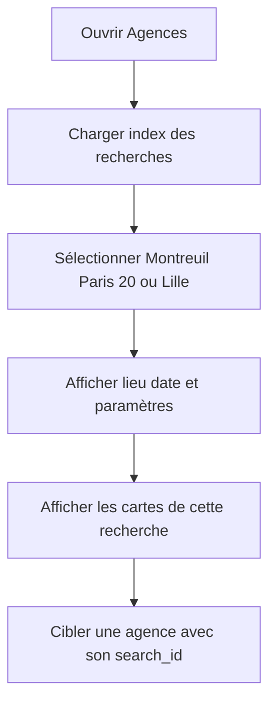
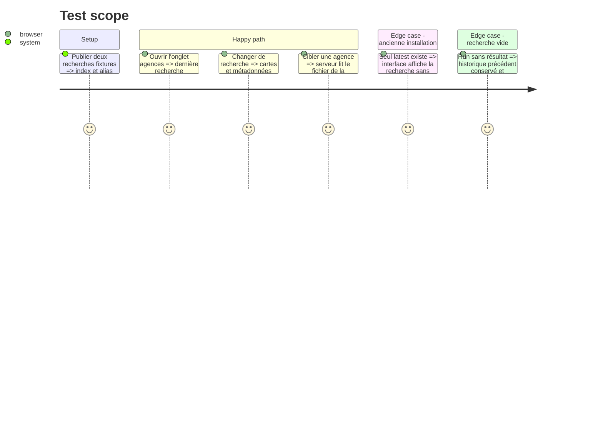

# Instruction: Historique par recherche et sélecteur géographique

## Architecture projection

> Tree of the final files. ✅ create · ✏️ modify · ❌ delete

```txt
.
├── tools/
│   └── ✏️ agency_prospecting_v2.py
├── server/
│   ├── ✏️ routes/applications.js
│   └── ✏️ services/agenciesService.js
├── front/
│   ├── ✏️ src/App.jsx
│   └── ✏️ src/App.css
├── ✏️ CLAUDE.md
├── docs/
│   ├── ✏️ AGENCIES_SCHEMA.md
│   └── ✅ AGENCY_PROSPECTING_RUNBOOK.md
└── tests/
    ├── ✏️ test_agency_prospecting.py
    └── ✏️ test_deployment_contract.py
```

## User Journey



## Test Scope



## Wireframe

```txt
┌─────────────────────────────────────────────────────────────┐
│ (1) Agences web · total · dernière mise à jour              │
├─────────────────────────────────────────────────────────────┤
│ (2) Recherche [ Montreuil ▾ ]  zone · rayon · date          │
├─────────────────────────────────────────────────────────────┤
│ (3) Résumé : trouvées · vérifiées · adresse connue · cache  │
├────────────────────────────┬────────────────────────────────┤
│ (4) Carte agence           │ (4) Carte agence               │
│ nom · site · distance      │ nom · site · distance          │
│ adresse + source           │ adresse + source               │
│ points forts / faibles     │ points forts / faibles         │
│ angle candidature         │ angle candidature              │
│ [Cibler cette agence]      │ [Cibler cette agence]          │
└────────────────────────────┴────────────────────────────────┘
```

1. En-tête : identité de la vue et fraîcheur des données.
2. Sélecteur : recherche géographique active et paramètres qui l'ont produite.
3. Résumé : métriques de la recherche sélectionnée.
4. Carte : preuves géographiques, analyse d'adéquation et action existante.

## Tasks to do

### `1)` Versionner chaque résultat de recherche

> Empêcher un run de détruire les résultats des autres villes.

1. Écrire `front/public/data/agencies/searches/<search_id>.json` de façon atomique.
2. Maintenir `front/public/data/agencies/index.json` avec identifiant, ville/zone, date, rayon, compte et état.
3. Maintenir `latest.json` comme copie/alias de compatibilité après succès seulement.
4. Définir une politique de rétention explicite sans supprimer silencieusement une recherche épinglée.

### `2)` Faire porter le contexte par l'API

> Garantir que le ciblage utilise la recherche affichée.

1. Ajouter `search_id` aux appels de ciblage et valider l'identifiant contre l'index.
2. Lire l'agence dans le fichier sélectionné, avec repli contrôlé sur `latest.json` pour les anciens clients.
3. Exposer l'index et les résultats par routes JSON plutôt que dépendre uniquement des fichiers statiques.
4. Exposer les analyses persistées depuis `data/agency_analyses.json` sans rendre le fichier brut modifiable par le navigateur.

### `3)` Ajouter le sélecteur et la géographie au front

> Montrer clairement ce que l'utilisateur consulte.

1. Charger l'index, sélectionner le dernier run valide et mémoriser le choix localement.
2. Afficher ville/zone, date, rayon, origine et statistiques.
3. Afficher forces, faiblesses et angle sur chaque carte sans masquer les sources d'adresse.
4. Conserver l'expérience actuelle si seul `latest.json` existe.
5. Joindre les analyses persistées par domaine et afficher leur date, leur état courant/obsolète et leur niveau de confiance.
6. Permettre de filtrer ou distinguer visuellement `agence` et `formation` sans masquer l'une des catégories par défaut.

### `4)` Mettre à jour les conventions durables

> Donner aux futurs agents les mêmes frontières et garde-fous que le code.

1. Documenter dans `CLAUDE.md` et le runbook : texte web = donnée non fiable, adresse jamais déduite, registre non juge, catégories agence/formation et limites de coût.
2. Décrire fichiers runtime, snapshots immuables, caches, commandes et procédure de reprise.
3. Faire du runbook la source à référencer par toute skill Hermes externe ; si cette skill vit hors dépôt, la mise à jour est une livraison distincte explicitement autorisée.

## Test acceptance criteria

| Task | Acceptance criteria |
| ---- | ------------------- |
| 1 | Deux runs Montreuil et Lille créent deux fichiers consultables ; le second ne modifie pas le premier et devient `latest`. |
| 2 | Une agence est ciblée depuis le fichier correspondant au `search_id` affiché ; un identifiant inconnu est refusé explicitement. |
| 3 | Le front permet de basculer entre les deux recherches et affiche pour chacune sa géographie, sa date, ses propres cartes et l'analyse persistée correspondante. |
| 4 | Un nouvel agent peut identifier depuis les documents versionnés les sources, limites, catégories, règles anti-invention et plafonds du pipeline. |
