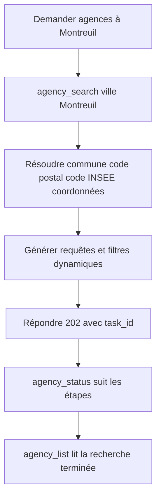
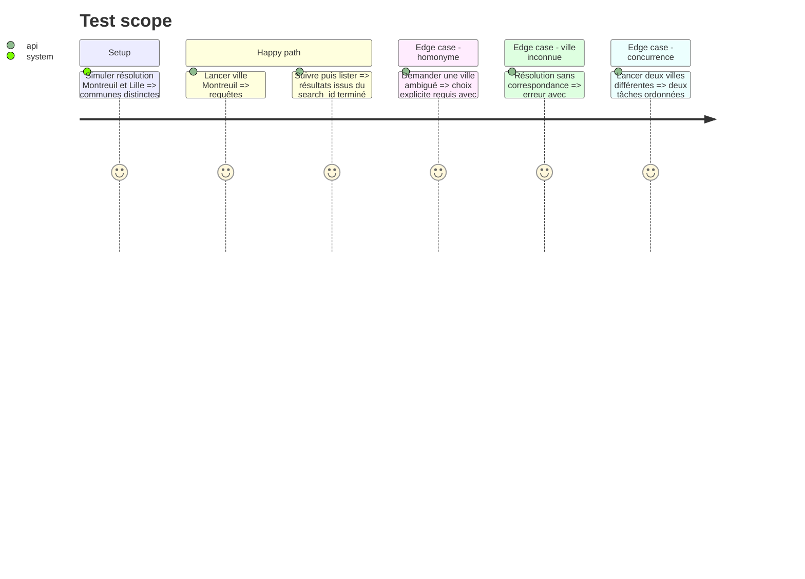

# Instruction: Mode ville générique de bout en bout

## Architecture projection

> Tree of the final files. ✅ create · ✏️ modify · ❌ delete

```txt
.
├── tools/
│   └── ✏️ agency_prospecting_v2.py
├── server/
│   ├── ✏️ routes/applications.js
│   └── ✏️ services/agenciesService.js
├── ✏️ hermes_mcp_server.py
├── docs/
│   └── ✏️ AGENCIES_SCHEMA.md
└── tests/
    ├── ✏️ test_agency_prospecting.py
    ├── ✏️ test_hermes_mcp_server.py
    └── ✏️ test_deployment_contract.py
```

## User Journey



## Test Scope



## Tasks to do

### `1)` Résoudre une ville sans catalogue interne

> Transformer un libellé utilisateur en périmètre géographique stable.

1. Ajouter `--ville` mutuellement exclusif avec `--zone`.
2. Résoudre nom, département, code postal, code INSEE et coordonnées via une source publique ; exiger le département en cas d'homonymie.
3. Construire dynamiquement deux familles conservées jusqu'au résultat : agence web/WordPress/développement et formation numérique/RGAA/web.
4. Filtrer en priorité sur l'adresse vérifiée et le code commune, jamais seulement sur la présence du nom dans une page.

### `2)` Propager la ville dans Node et MCP

> Rendre « trouve-moi des agences à Montreuil » directement exprimable.

1. Accepter `city` dans `POST /api/agencies/search` et dans l'outil `agency_search`.
2. Inclure la ville résolue dans la clé de déduplication, le statut et le `search_id`.
3. Faire retourner `search_id` à `agency_status`, puis le consommer par `agency_list`.
4. Conserver `zone` pour compatibilité pendant la migration, sans ajouter de nouvelles villes dans `ZONES`.

### `3)` Réduire le temps du parcours ciblé

> Favoriser les résultats locaux fiables avant le crawl large.

1. Interroger le registre officiel et les moteurs comme sources complémentaires avec les deux familles de requêtes de la ville.
2. Limiter le crawl approfondi aux candidats locaux dédoublonnés et présélectionnés par les exclusions du barème corrigé, sans faire du registre un juge métier.
3. Publier des étapes de progression séparées : résolution, registre, découverte web, crawl, géocodage, IA, publication.
4. Mesurer durées et volumes par étape dans le payload sans journaliser de données personnelles.

### `4)` Supprimer la nécessité d'étendre les zones statiques

> Garder les anciennes zones seulement comme préréglages compatibles.

1. Documenter que `ZONES` représente des préréglages historiques, pas la liste des villes supportées.
2. Tester Montreuil et Lille pour prouver le fonctionnement IDF et hors IDF.
3. Vérifier qu'une ville nouvelle fonctionne sans modification du code source.

## Test acceptance criteria

| Task | Acceptance criteria |
| ---- | ------------------- |
| 1 | `--ville Montreuil` résout 93100/93048 et `--ville Lille` résout son propre périmètre, sans entrée ajoutée dans `ZONES` et sans perdre les résultats `formation`. |
| 2 | Hermes lance, suit et relit une recherche par ville sans confondre deux tâches de villes différentes. |
| 3 | Le statut expose les étapes et le crawl profond ne traite que les candidats appartenant au périmètre vérifié. |
| 4 | Une fixture de ville absente du code produit des requêtes et un résultat historisé sans modification d'une constante de communes. |

## Écarts assumés à la livraison

1. **Le critère 1 annonçait `93066` : ce n'est pas le code INSEE de Montreuil.**
   La commune résolue est `93048` (code postal `93100`), vérifié en direct sur
   l'API Découpage administratif. Le critère a été corrigé plutôt que le test
   ajusté à la valeur attendue — figer `93066` aurait fabriqué un périmètre
   plausible et faux, exactement ce que la chaîne interdit ailleurs. Au passage,
   la supposition « Montreuil est sans ambiguïté » ne tient pas non plus : trois
   communes portent ce nom (93, 85, 28), d'où l'exigence de `--departement`.
2. **Les tests vivent dans `tests/test_city_search.py`**, un fichier dédié, au
   lieu d'être dispersés dans les trois suites listées par la projection
   d'architecture. Le mode ville est un parcours complet — résolution, requêtes,
   périmètre, étapes, Node, MCP — et le lire d'un seul tenant vaut mieux que le
   reconstituer dans trois fichiers. Les fixtures sont dans
   `tests/fixtures/geo_communes.json`, la suite tourne hors ligne.
3. **`tools/` et `agency_analysis/` ne sont pas copiés dans l'image Docker.**
   Écart antérieur à cette phase — il touche aussi `--zone` — et donc non
   corrigé ici, mais il rend la prospection inopérante dans le conteneur. À
   traiter séparément.
