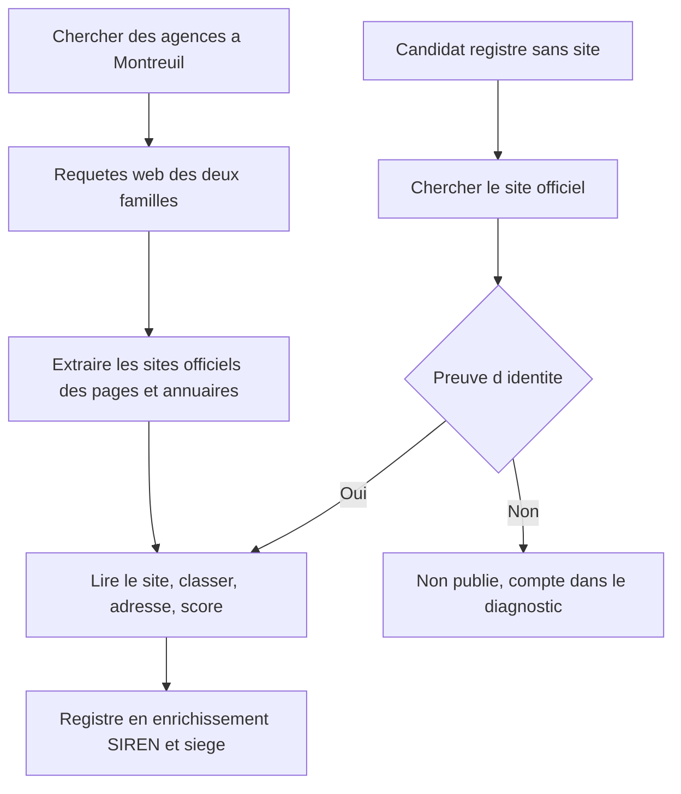
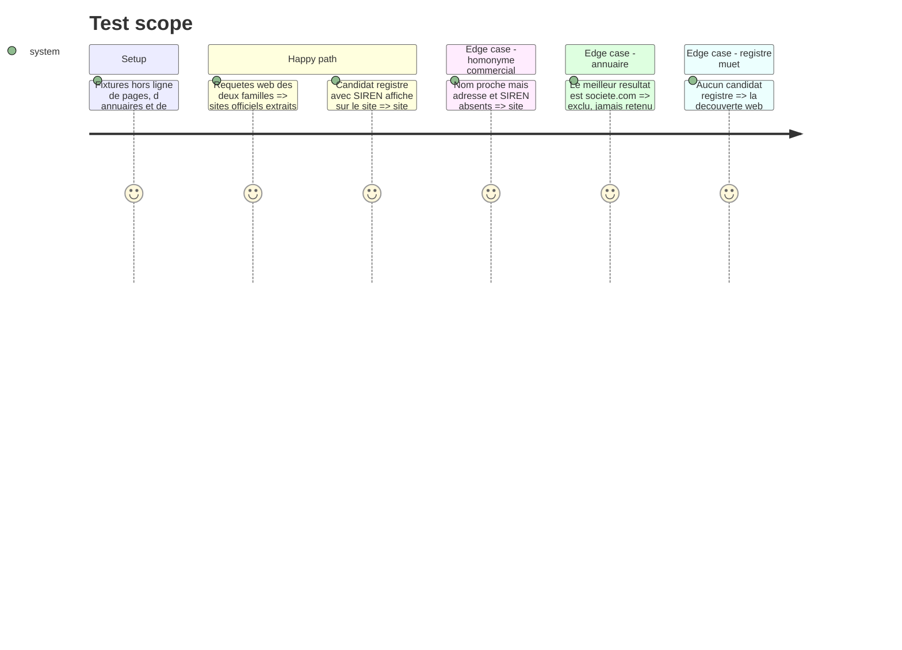

# Instruction: Découverte web-first et recherche du site officiel

## Pourquoi cette phase existe

La phase 1 a branché le registre public comme source de candidats. Le constat
d'usage est net : **la recherche par annuaire ne produit que du bruit.** Un
candidat registre arrive sans site, donc sans auto-description, donc en
`category: incertain` et `score: 0` — KONEXIO, organisme de formation dev web et
cible parfaitement légitime, s'affichait « Agence 0/100 ».

Le correctif `78c9510` a masqué ces fiches (`is_publishable_result`, seules
`agence` et `formation` sont publiées). C'était la bonne première réaction, mais
elle traite le symptôme : `registry_record()` pose `website: None` en dur et
aucune étape ne va chercher le site. Le registre est passé de source bruyante à
**source morte**. On a supprimé l'affichage du bruit, pas produit du signal.

Cette phase répare la cause, en deux mouvements :

1. le **web redevient la source primaire** de découverte — c'est lui qui révèle
   l'auto-description, donc le seul verdict d'activité que ce projet accepte ;
2. le registre **enrichit** une fiche trouvée par le web, et ne propose plus de
   fiche qu'au travers d'une étape explicite « trouver le site officiel » qui
   exige une preuve d'identité.

## Architecture projection

> Tree of the final files. ✅ create · ✏️ modify · ❌ delete

```txt
.
├── tools/
│   ├── ✏️ agency_prospecting_v2.py
│   ├── ✏️ agency_registry.py
│   └── ✅ official_site.py
├── company_analysis/
│   └── ✏️ verifier.py
├── docs/
│   ├── ✏️ AGENCIES_SCHEMA.md
│   └── ✏️ AGENCY_PROSPECTING_RUNBOOK.md
└── tests/
    ├── ✅ test_official_site.py
    └── ✏️ test_agency_prospecting.py
```

## User Journey



## Test Scope



## Tasks to do

### `1)` Inverser l'ordre : le web d'abord

> Ce qui révèle l'activité, c'est ce que la structure écrit sur elle-même.

1. Faire de la découverte web la source primaire et du registre une source
   secondaire, sans supprimer ce dernier ni son mode `--no-registry`.
2. Étendre les deux familles de requêtes de la phase 4 aux formulations réelles
   du besoin : `agence web`, `agence WordPress`, `agence développement web`,
   `formation développeur web`, `organisme formation numérique`,
   `formation accessibilité RGAA`, `école développement web`, `atelier numérique`
   — chacune combinée à la ville résolue.
3. Crawler les pages listes et annuaires spécialisés pour en **extraire les
   domaines cités**, sans jamais publier l'annuaire lui-même.
4. Conserver l'ordre de lecture existant après découverte : lire le site →
   classer → adresse/contact → score.

### `2)` Ajouter l'étape manquante : trouver le site officiel

> `registre → recherche site officiel → vérification identité → crawl → score`,
> jamais `registre → affichage direct`.

1. Créer `tools/official_site.py` exposant une recherche de site à partir d'une
   raison sociale, d'une commune et, quand il existe, d'un SIREN.
2. Exclure par liste les annuaires et plateformes : `societe.com`, `pappers`,
   `manageo`, `verif.com`, `infogreffe`, `linkedin`, `facebook`, `pagesjaunes`.
   Un profil d'annuaire n'est pas un site officiel.
3. N'accepter un domaine qu'avec une **preuve nommée**, parmi : SIREN ou SIRET
   affiché sur le site ; adresse concordante en page contact ou mentions légales ;
   raison sociale identique ou nom commercial très proche ; plusieurs sources
   indépendantes convergeant sur le même domaine.
4. **Sans preuve, on ignore.** Pas de domaine deviné, pas de `nom.fr` construit à
   partir du nom — c'est exactement la fabrication que le reste de la chaîne
   interdit.

### `3)` Tracer la preuve, comme `how` et `city_match`

> Une acceptation qu'on ne peut pas relire est une acceptation qu'on ne peut pas
> contester.

1. Ajouter `site_match` sur la fiche, avec le vocabulaire fermé :
   `siren affiché` | `adresse concordante` | `raison sociale` | `sources convergentes` | `aucun`.
2. Ajouter `site_match_evidence` citant l'extrait ou les URL qui ont fondé
   l'acceptation, comme `classify_self_description` cite déjà le sien.
3. Un site sans `site_match` ne remonte pas dans `website` : il attend dans
   `site_candidates`, sur le modèle d'`identity_candidates`.
4. Documenter le champ dans `docs/AGENCIES_SCHEMA.md` et le runbook.

### `4)` Rendre le registre utile en enrichissement

> Confirmer une fiche existante, pas en proposer une.

1. Quand une fiche vient du web, rapprocher le registre pour compléter SIREN,
   siège et existence légale — en respectant `identity_match`, qui interdit déjà
   à un rapprochement par nom seul de faire monter le SIREN.
2. Garder les candidats registre non résolus dans le diagnostic, comptés et
   nommés par motif d'exclusion (`sans site`, `site sans preuve`,
   `site exclu (annuaire)`), à côté de `publication_filter`.
3. Ne jamais faire du registre un juge d'activité : un APE `62.01Z` ou un APE
   formation ne classe rien. La règle ne change pas, cette phase la rend enfin
   applicable puisqu'un site existe pour trancher.

## Test acceptance criteria

| Task | Acceptance criteria |
| ---- | ------------------- |
| 1 | Sur une fixture de ville, la découverte web seule (`--no-registry`) produit des résultats publiables dans les deux familles ; un annuaire présent dans les pages est exploité comme source de domaines et n'apparaît jamais comme résultat. |
| 2 | Un candidat registre dont le site affiche son SIREN est publié avec ce site ; un candidat dont le seul rapprochement est un nom proche n'est pas publié et reste compté ; aucun domaine n'est produit sans preuve. |
| 3 | Toute fiche publiée avec un `website` issu de cette étape porte un `site_match` ≠ `aucun` et une preuve citée ; les candidats sans preuve sont lisibles dans `site_candidates`. |
| 4 | Le récapitulatif distingue les candidats registre par motif d'exclusion, et le SIREN d'un rapprochement par nom seul ne monte toujours pas dans la fiche. |

## Dépendances et écarts connus à l'entrée

1. **`latest.json` suit désormais la dernière passe publiée, même vide**
   (`78c9510`). Les trois documents qui disaient « dernière passe réussie » ont
   été réalignés avant cette phase. Le comportement est voulu : une correction
   qui retire des faux positifs doit vider l'écran, pas laisser le bruit d'avant
   s'y faire passer pour un résultat frais.
2. **YOTTA avait été retiré de `config/companies.csv`** avec trois lignes sans
   site, alors que son site répond (`https://www.yotta-agency.com/`, HTTP 200).
   Ligne restaurée avant cette phase ; c'était un dommage collatéral.
3. **`tools/` et `agency_analysis/` ne sont pas copiés dans l'image Docker.**
   Écart hérité de la phase 4, non traité ici, mais il rend la prospection
   inopérante en conteneur.
