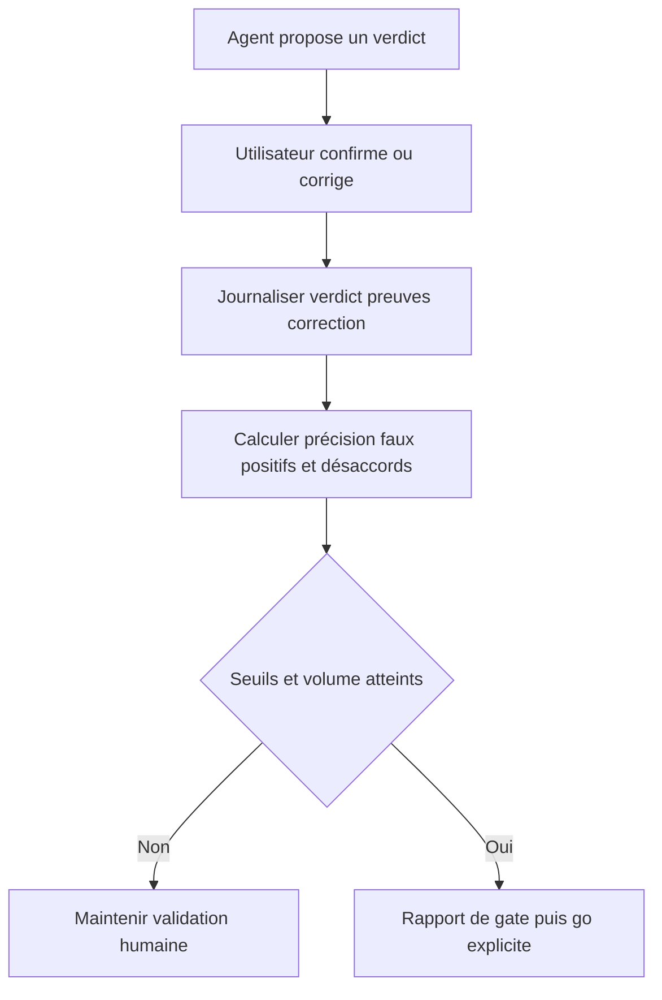
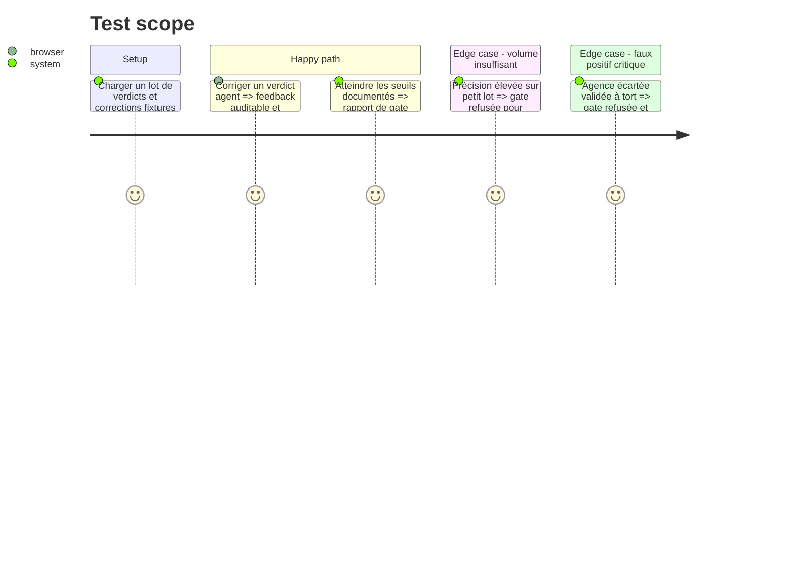

# Instruction: Mesure du juge d'agences et porte de fiabilité

## Architecture projection

> Tree of the final files. ✅ create · ✏️ modify · ❌ delete

```txt
.
├── agency_analysis/
│   ├── ✏️ fit_analyzer.py
│   └── ✅ evaluation.py
├── front/
│   ├── ✏️ src/App.jsx
│   └── ✏️ src/App.css
├── data/
│   └── ✅ agency_judge_feedback.json
├── docs/
│   └── ✅ AGENCY_AUTOMATION_GATES.md
└── tests/
    └── ✅ test_agency_judge_evaluation.py
```

## User Journey



## Test Scope



## Tasks to do

### `1)` Capturer les validations humaines

> Comparer réellement le juge à la décision de Cundo.

1. Ajouter confirmer, corriger et écarter sur les analyses du front.
2. Journaliser l'analyse, ses preuves, la décision humaine, la date et la version du modèle/prompt.
3. Ne jamais stocker le profil maître complet dans le feedback.

### `2)` Mesurer la fiabilité

> Transformer les validations en indicateurs de décision.

1. Calculer accord global, précision par verdict, faux positifs, faux négatifs et corrections de positionnement.
2. Séparer les métriques par version de modèle/prompt et invalider une série après changement majeur.
3. Produire un rapport lisible et exportable.

### `3)` Formaliser la porte d'autonomie

> Empêcher le passage automatique à la préparation sur une simple impression.

1. Documenter volume minimal, seuils, absence d'incident critique et fenêtre temporelle.
2. Rendre la gate purement informative : elle ne déclenche jamais la phase suivante.
3. Exiger une décision explicite de Cundo pour ouvrir la phase 6.

## Test acceptance criteria

| Task | Acceptance criteria |
| ---- | ------------------- |
| 1 | Toute correction humaine reste reliée au verdict, aux preuves et à la version qui l'ont produite. |
| 2 | Les métriques sont reproductibles depuis le journal et distinguent au minimum faux positifs et faux négatifs. |
| 3 | Une gate insuffisante ou un incident critique bloque l'éligibilité ; une gate réussie attend encore un `go` humain. |
