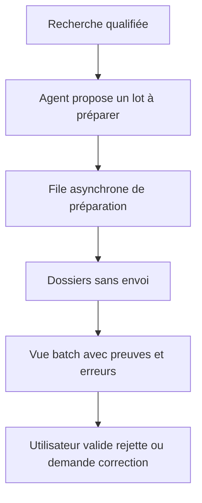
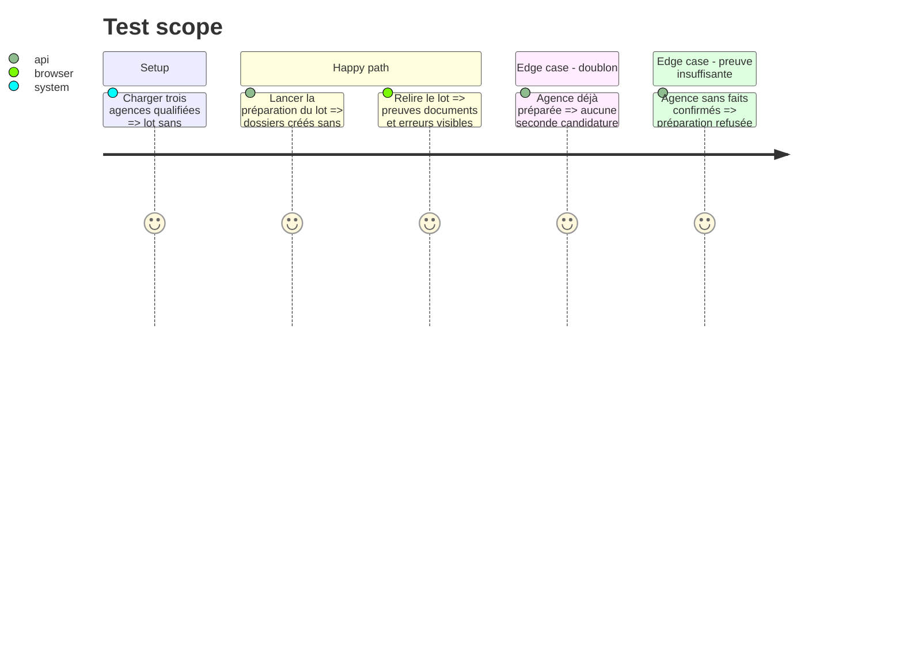

# Instruction: Préparation automatique avec validation humaine en lot

## Architecture projection

> Tree of the final files. ✅ create · ✏️ modify · ❌ delete

```txt
.
├── server/
│   ├── ✏️ routes/applications.js
│   └── ✏️ services/agenciesService.js
├── hermes_commands/
│   └── ✏️ company_prepare.py
├── front/
│   ├── ✏️ src/App.jsx
│   └── ✏️ src/App.css
├── docs/
│   └── ✏️ AGENCY_AUTOMATION_GATES.md
└── tests/
    ├── ✏️ test_company_prospection.py
    └── ✏️ test_deployment_contract.py
```

## User Journey



## Test Scope



## Tasks to do

### `1)` Créer une file de préparation en lot

> Préparer plusieurs dossiers sans bloquer la requête ni produire d'envoi.

1. Réutiliser la file asynchrone et dédupliquer par domaine/recherche.
2. Préparer uniquement les verdicts autorisés par les règles de lot.
3. Garder `with_cv=false` par défaut et rendre le CV explicite.

### `2)` Ajouter la revue batch

> Faire passer Cundo de l'exécution dossier par dossier à la supervision.

1. Afficher documents, preuves, analyse, erreurs et statut pour chaque dossier.
2. Permettre valider, rejeter ou renvoyer en correction individuellement et en sélection multiple.
3. Ne jamais transformer une validation de lot en envoi.

### `3)` Journaliser le parcours

> Rendre chaque décision et reprise explicables.

1. Enregistrer recherche source, analyse, paramètres, versions et action humaine.
2. Protéger les dossiers existants contre les doubles préparations.
3. Exiger un `go` explicite après la gate de phase 5 avant d'activer ce mode.

## Test acceptance criteria

| Task | Acceptance criteria |
| ---- | ------------------- |
| 1 | Un lot admissible produit une tâche asynchrone et des dossiers locaux, sans approbation ni envoi. |
| 2 | Chaque dossier peut être validé ou rejeté en batch sans modifier les autres dossiers du lot. |
| 3 | Deux demandes identiques ne créent pas de doublon et toute action reste traçable jusqu'à la recherche source. |
