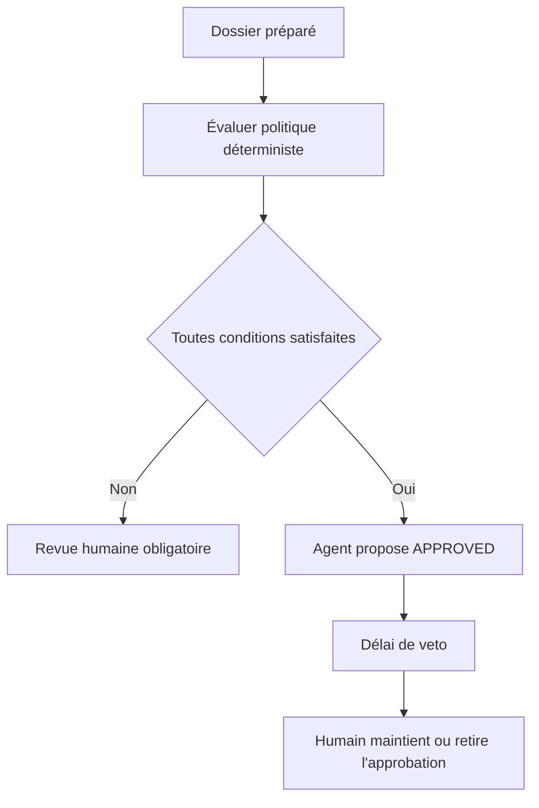
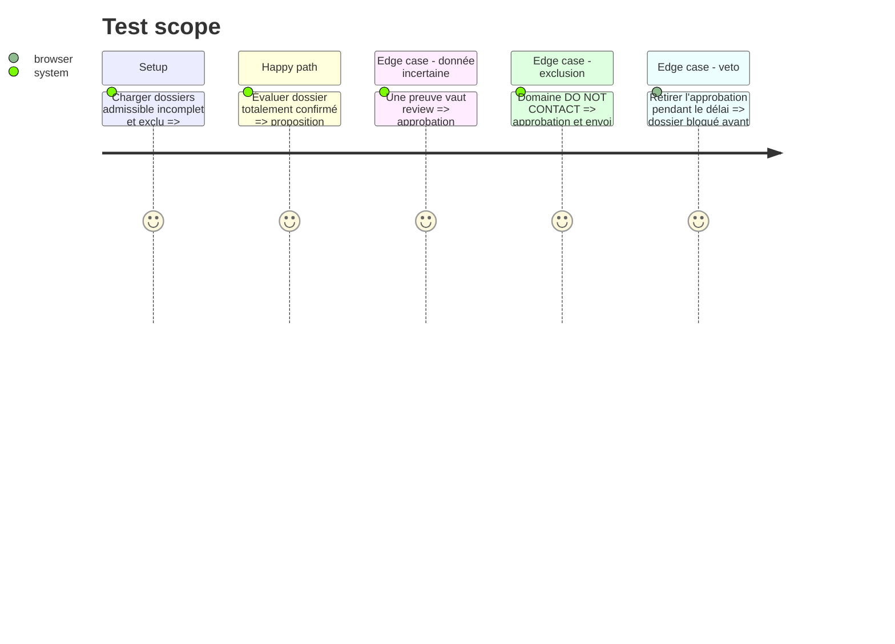

# Instruction: Approbation conditionnelle par agent

## Architecture projection

> Tree of the final files. ✅ create · ✏️ modify · ❌ delete

```txt
.
├── applications/
│   └── ✅ agency_approval_policy.py
├── server/
│   ├── ✏️ routes/applications.js
│   └── ✏️ services/agenciesService.js
├── front/
│   ├── ✏️ src/App.jsx
│   └── ✏️ src/App.css
├── docs/
│   └── ✏️ AGENCY_AUTOMATION_GATES.md
└── tests/
    └── ✅ test_agency_approval_policy.py
```

## User Journey



## Test Scope



## Tasks to do

### `1)` Écrire la politique déterministe

> Encadrer l'agent avec des conditions exécutables.

1. Exiger verdict haut, faits requis `CONFIRMED`, identité non ambiguë et documents valides.
2. Refuser `review`, preuve manquante, domaine exclu, doublon, quota atteint ou erreur de génération.
3. Versionner la politique et inclure chaque règle appliquée dans l'audit.

### `2)` Ajouter la proposition d'approbation agent

> Autoriser l'agent à proposer `APPROVED` sans envoyer.

1. Séparer `agent_proposed`, `APPROVED` et `sent`.
2. Ajouter un délai de veto configurable et une vue des approbations en attente.
3. Permettre retrait global ou individuel avant échéance.

### `3)` Ouvrir la phase sous gate

> N'activer ce comportement qu'après une période propre de préparation supervisée.

1. Définir les métriques de la phase 6 nécessaires : erreurs, corrections, doublons et incidents.
2. Exiger plusieurs semaines sans incident critique et un `go` explicite.
3. Garder un mode désactivé par défaut et un retour immédiat au tout-humain.

## Test acceptance criteria

| Task | Acceptance criteria |
| ---- | ------------------- |
| 1 | Toute condition non satisfaite produit une revue humaine et indique exactement la règle bloquante. |
| 2 | Une proposition agent ne peut jamais envoyer ; le veto humain retire l'approbation avant échéance. |
| 3 | Le mode reste désactivé sans gate documentée et peut être coupé sans modifier les dossiers existants. |
