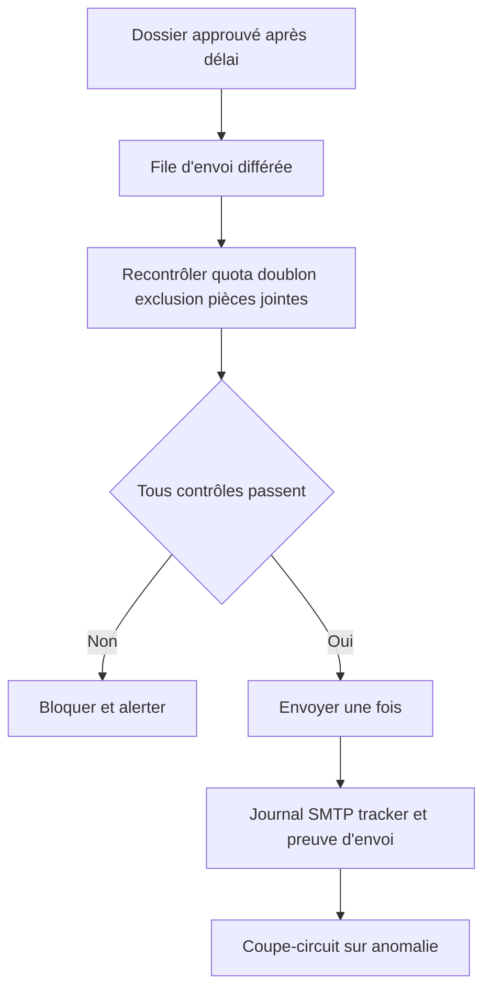
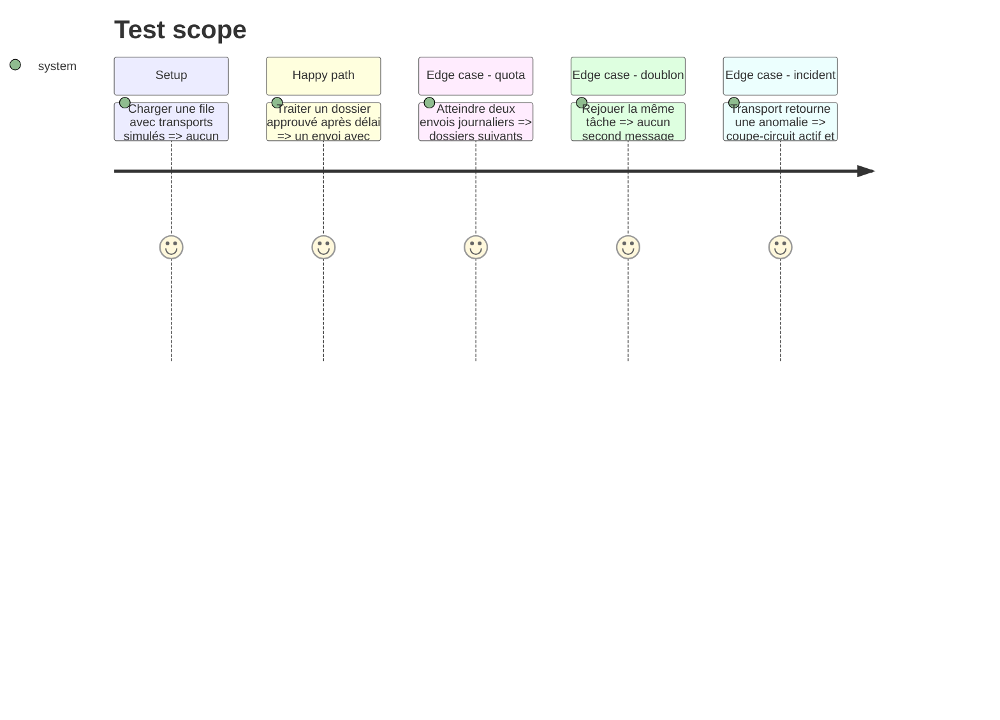

# Instruction: Envoi automatique sous quotas et coupe-circuit

## Architecture projection

> Tree of the final files. ✅ create · ✏️ modify · ❌ delete

```txt
.
├── applications/
│   ├── ✏️ send.py
│   └── ✅ agency_send_queue.py
├── server/
│   ├── ✏️ routes/applications.js
│   └── ✏️ services/agenciesService.js
├── front/
│   ├── ✏️ src/App.jsx
│   └── ✏️ src/App.css
├── deploy/
│   └── ✅ agency-send-worker.service
├── docs/
│   └── ✏️ AGENCY_AUTOMATION_GATES.md
└── tests/
    ├── ✏️ test_sending.py
    └── ✅ test_agency_send_queue.py
```

## User Journey



## Test Scope



## Tasks to do

### `1)` Construire la file d'envoi sûre

> Garantir exactement un envoi pour un dossier admissible.

1. Utiliser une clé d'idempotence durable par candidature et destinataire.
2. Revalider au dernier moment approbation, délai, quota, exclusion, destinataire et pièces jointes.
3. Reporter proprement un dossier lorsque le quota journalier est atteint.

### `2)` Ajouter coupe-circuit et supervision

> Pouvoir arrêter immédiatement toute sortie externe.

1. Ajouter un kill-switch désactivant le worker sans modifier les dossiers.
2. Suspendre automatiquement la file sur erreurs répétées, incohérence d'audit ou pièce jointe manquante.
3. Afficher file, reports, blocages, envois et cause du coupe-circuit.

### `3)` Journaliser la preuve réelle d'envoi

> Distinguer génération, approbation, tentative et livraison SMTP acceptée.

1. Enregistrer identifiant de message, destinataire, horodatage, noms des pièces et réponse du transport sans secret.
2. Mettre à jour le tracker uniquement après acceptation du transport.
3. Conserver la reprise idempotente après redémarrage.

### `4)` Réserver l'activation à la décision finale

> L'envoi automatique reste la dernière porte et n'est jamais induit par les phases précédentes.

1. Exiger la gate de phase 7, un test à blanc prolongé et une décision explicite finale de Cundo.
2. Déployer initialement en mode simulation.
3. Documenter désactivation, reprise, audit et procédure d'incident.

## Test acceptance criteria

| Task | Acceptance criteria |
| ---- | ------------------- |
| 1 | Un dossier admissible est envoyé au plus une fois ; quota, exclusion ou pièce manquante empêchent l'envoi. |
| 2 | Le kill-switch et le coupe-circuit suspendent immédiatement la file sans perdre les dossiers en attente. |
| 3 | Le tracker passe à `applied` seulement après acceptation du transport et conserve une preuve sans exposer de secret. |
| 4 | Sans décision finale et activation explicite, le worker reste en simulation et aucune sortie externe n'a lieu. |
