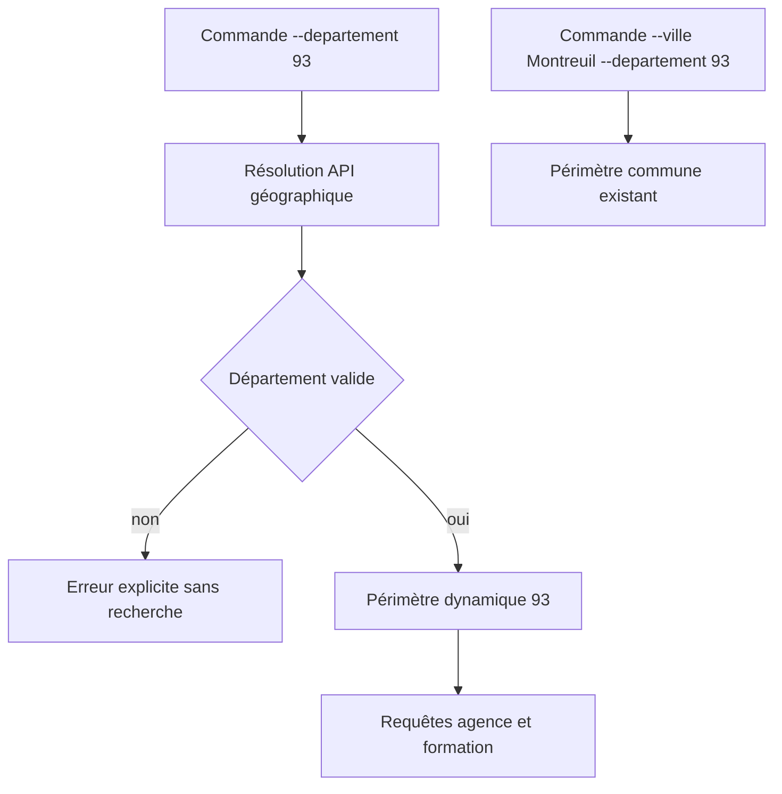
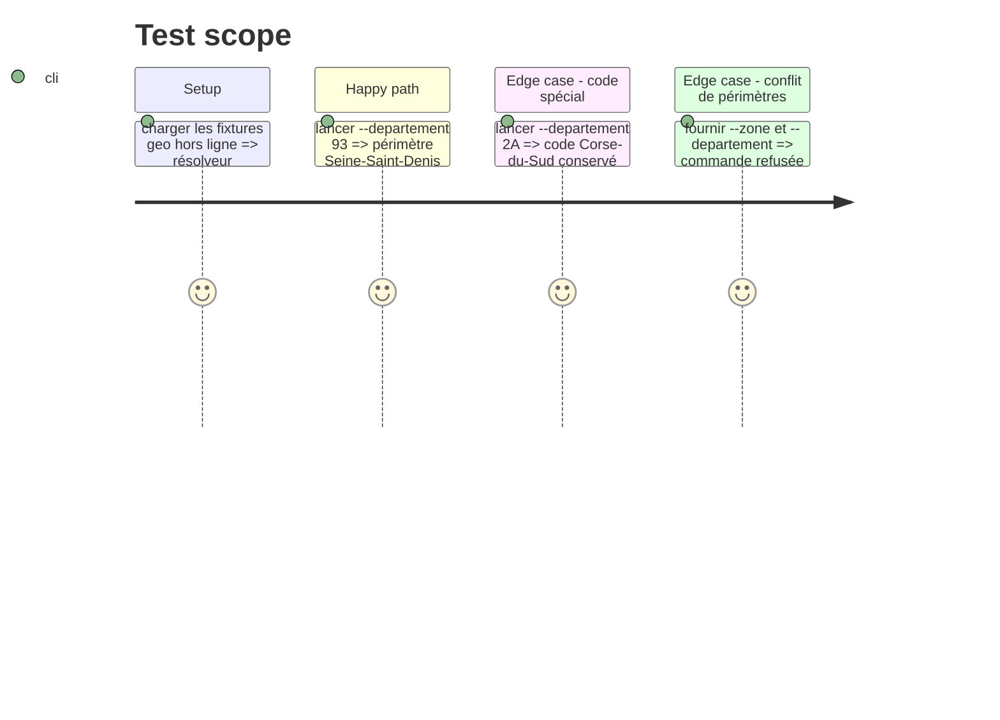

# Instruction: Résolution dynamique et contrat de périmètre

## Architecture projection

> Tree of the final files. ✅ create · ✏️ modify · ❌ delete

```txt
tools/city_resolver.py                 ✏️ résoudre un département et construire son périmètre dynamique
tools/agency_prospecting_v2.py         ✏️ accepter --departement seul et produire un snapshot départemental
tests/test_city_search.py              ✏️ couvrir codes, noms, départements inconnus et exclusivité des modes
tests/fixtures/geo_communes.json       ✏️ ajouter les réponses départementales hors ligne
```

## User Journey



## Test Scope



## Tasks to do

### `1) Résoudre un département sans catalogue local`

> Construire une représentation vérifiable du département depuis geo.api.gouv.fr.

1. Ajouter `resolve_department()` acceptant code ou nom, avec normalisation de `05`, `2A`, `2B` et outre-mer.
2. Charger nom, code et liste des communes avec leurs codes INSEE/codes postaux ; refuser une réponse incomplète.
3. Renvoyer une erreur lisible pour un département inconnu, ambigu ou indisponible, sans lancer de découverte.
4. Construire une clé stable `departement-<code>-<slug>` et une zone dynamique distincte de `ZONES`.

### `2) Définir les combinaisons CLI`

> Préserver le comportement ville tout en ajoutant le département seul.

1. Accepter `--departement 93` sans `--ville`.
2. Conserver `--ville Montreuil --departement 93` pour désambiguïser une commune.
3. Refuser `--zone` avec `--ville` ou `--departement`, et refuser un `--radius` départemental tant qu'une mesure de distance départementale n'est pas définie.
4. Générer des familles de requêtes départementales distinctes pour `agence` et `formation`, portant le nom officiel du département.

## Test acceptance criteria

| Task | Acceptance criteria |
| ---- | ------------------- |
| 1 | `93`, `Seine-Saint-Denis`, `2A` et un code outre-mer produisent un périmètre dynamique ou une erreur explicite ; aucune entrée n'est ajoutée à `ZONES`. |
| 2 | Les trois modes sont exclusifs et le mode commune existant conserve exactement son périmètre. |
