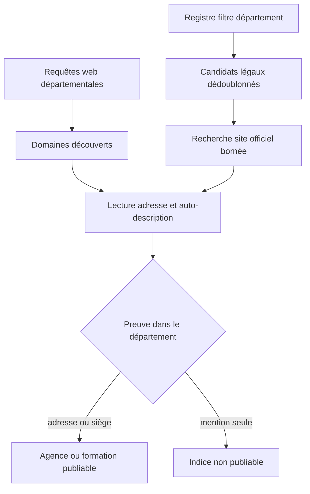
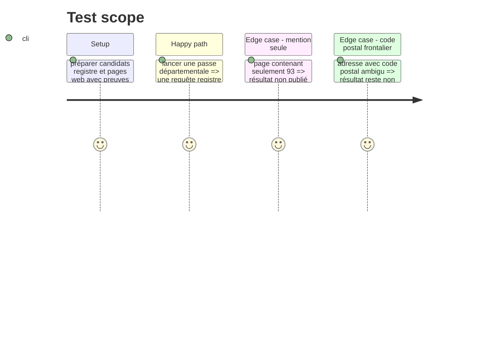

# Instruction: Découverte, registre et preuve départementale

## Architecture projection

> Tree of the final files. ✅ create · ✏️ modify · ❌ delete

```txt
tools/agency_prospecting_v2.py         ✏️ exécuter une passe départementale bornée et publier ses mesures
tools/agency_registry.py               ✏️ exposer un agrégat départemental dédoublonné
tools/city_resolver.py                 ✏️ vérifier une implantation départementale depuis une commune/adresse connue
tests/test_agency_prospecting.py       ✏️ protéger filtre registre, publication et limites de coût
tests/test_city_search.py              ✏️ protéger les niveaux de preuve géographique
```

## User Journey



## Test Scope



## Tasks to do

### `1) Adapter les sources au périmètre large`

> Éviter une prospection commune par commune.

1. Interroger `RegistryClient.search(departement=...)` une fois par famille NAF, avec pagination, cadence et déduplication existantes.
2. Introduire un plafond configuré de recherches de site officiel pour les candidats registre départementaux, avec motifs publiés pour les non-traités.
3. Produire les requêtes web au niveau départemental et partager les mêmes plafonds de crawl/analyse IA que les autres passes.

### `2) Rendre la localisation départementale stricte`

> Publier uniquement une cible dont l'implantation est démontrée.

1. Ajouter un niveau `department_match` et sa preuve dans chaque résultat départemental.
2. Accepter une adresse web seulement si sa commune est résolue comme appartenant au département ; ne pas inférer le département depuis une simple mention ou un préfixe postal.
3. Accepter un siège registre seulement si son champ département/code commune correspond au périmètre résolu.
4. Conserver les résultats mention-only dans le rapport de diagnostic, mais les exclure de `agencies` publiées.

### `3) Publier des mesures interprétables`

> Distinguer un vrai vide d'un pipeline incomplet.

1. Inclure dans le snapshot le périmètre résolu, le nombre de communes, appels registre/web, plafonds atteints, motifs d'exclusion et comptes par `department_match`.
2. Garder `agence` et `formation` comme catégories distinctes de bout en bout.
3. Ne pas lancer d'analyse IA sur les candidats sans site officiel prouvé ni sur les résultats hors périmètre vérifié.

## Test acceptance criteria

| Task | Acceptance criteria |
| ---- | ------------------- |
| 1 | Une passe 93 ne lance pas une passe par commune, utilise le filtre registre départemental et respecte les plafonds publiés. |
| 2 | Une mention de « 93 » seule ne produit jamais une carte ; une adresse ou un siège vérifié dans le 93 peut être publié. |
| 3 | Le snapshot explique les candidats non publiés au lieu de présenter un vide comme une absence d'agences. |

