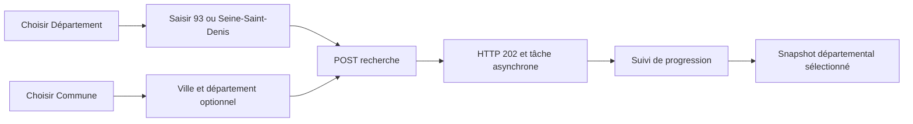
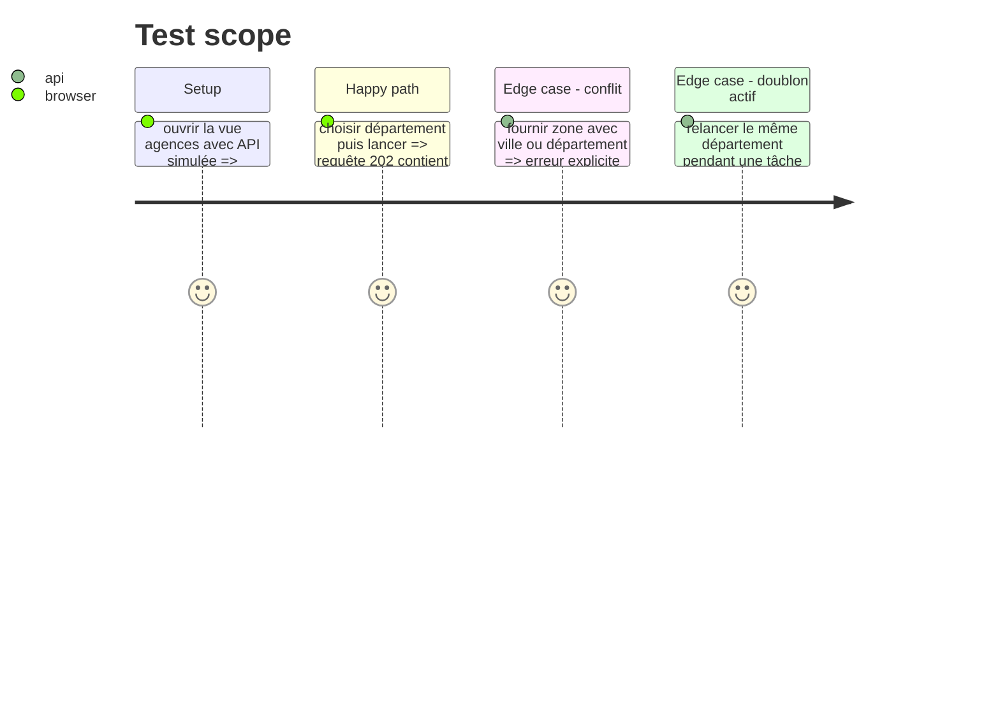

# Instruction: API asynchrone et interface de lancement

## Architecture projection

> Tree of the final files. ✅ create · ✏️ modify · ❌ delete

```txt
server/services/agenciesService.js     ✏️ transmettre et dédupliquer les requêtes départementales
server/routes/applications.js          ✏️ valider city/zone/departement et publier le statut de tâche
front/src/App.jsx                      ✏️ choisir commune, département ou préréglage et suivre la tâche
front/src/App.css                      ✏️ présenter le sélecteur de périmètre et les mesures départementales
tests/test_city_search.py              ✏️ vérifier le contrat Node et le rejet des paramètres ambigus
```

## User Journey



## Test Scope



## Wireframe

```txt
┌──────────────────────────────────────────────────────────────┐
│ (1) Recherche d'agences                                      │
├──────────────────────────────────────────────────────────────┤
│ (2) Périmètre : [Commune v] [___________________________]   │
│     Département optionnel : [___________________________]    │
│     ou [Département v] [93 / Seine-Saint-Denis__________]    │
│     ou [Préréglage v] [paris-20________________________]    │
│     [Lancer la recherche]                                    │
├──────────────────────────────────────────────────────────────┤
│ (3) Tâche : résolution · web · registre · vérification       │
├──────────────────────────────────────────────────────────────┤
│ (4) Recherche sélectionnée : Seine-Saint-Denis               │
│     périmètre résolu · preuves d'implantation · résultats    │
└──────────────────────────────────────────────────────────────┘
```

1. Choix explicite du mode, pour ne jamais confondre commune, département et préréglage.
2. Champs adaptés au mode choisi et soumission d'un seul périmètre.
3. État asynchrone et erreurs lisibles pendant la prospection.
4. Historique et résultats de la passe produite, pas de raccourci vers une passe précédente.

## Tasks to do

### `1) Étendre le contrat de tâche`

> Transporter un département seul de l'API à la CLI sans interpolation non validée.

1. Faire reconnaître `departement` seul par `runProspecting`, l'identifier dans `sameProspectingRequest` et transmettre `--departement` seul.
2. Refuser les mélanges zone/département, zone/ville et les corps sans périmètre ; conserver les validateurs de caractères existants.
3. Exposer dans le statut de tâche le type de périmètre et le département résolu, sans appeler une commune fictive.

### `2) Ajouter le lancement dans la vue agences`

> Permettre une recherche reproductible sans passer par une commande manuelle.

1. Ajouter un sélecteur de mode commune/département/préréglage et n'envoyer que les champs compatibles.
2. Réutiliser le polling existant de tâche, puis sélectionner le `search_id` retourné.
3. Afficher le nom/code départemental, les compteurs de preuve et les avertissements du snapshot.
4. Préserver le sélecteur d'historique, les filtres agence/formation et les recherches existantes.

## Test acceptance criteria

| Task | Acceptance criteria |
| ---- | ------------------- |
| 1 | `POST /api/agencies/search` accepte `{ "departement": "93" }`, crée une tâche unique et rejette toute combinaison ambiguë. |
| 2 | Un utilisateur peut lancer puis suivre une recherche départementale et consulter son snapshot sans effacer l'historique. |
