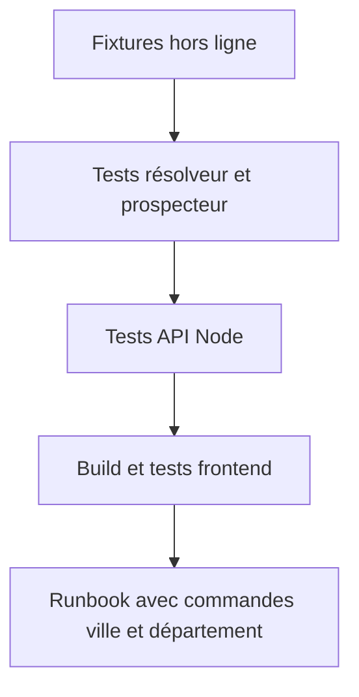
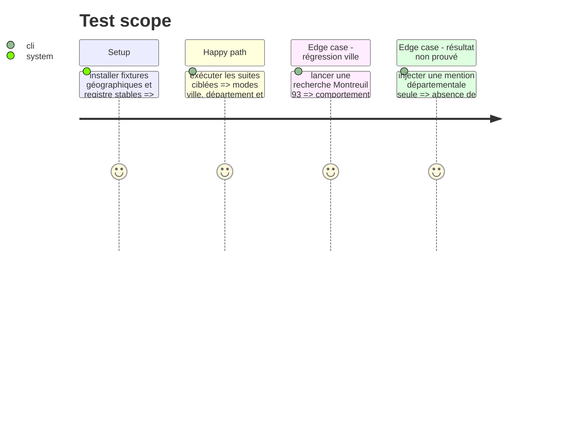

# Instruction: Tests de non-régression et documentation

## Architecture projection

> Tree of the final files. ✅ create · ✏️ modify · ❌ delete

```txt
tests/test_city_search.py              ✏️ parcours CLI/API département et cas d'ambiguïté
tests/test_agency_prospecting.py       ✏️ filtre, preuve, plafonds et publication départementaux
tests/test_deployment_contract.py      ✏️ contrat Docker/API des nouveaux arguments
docs/AGENCY_PROSPECTING_RUNBOOK.md     ✏️ commandes et règles de preuve du mode département
```

## User Journey



## Test Scope



## Tasks to do

### `1) Construire le jeu de régression`

> Rendre les comportements géographiques vérifiables sans réseau externe.

1. Ajouter fixtures pour 93, 2A et outre-mer, avec communes et cas de code postal ambigu.
2. Tester les erreurs de résolution, les trois modes exclusifs et la déduplication de tâche départementale.
3. Tester registre départemental, plafonds de site officiel, catégories agence/formation et filtres de publication.

### `2) Vérifier et documenter le parcours complet`

> Livrer une fonctionnalité opérable et sans lecture trompeuse des résultats.

1. Exécuter les tests Python ciblés, les tests Node, les tests frontend et le build.
2. Mettre à jour le runbook avec `--departement 93`, les contraintes de coût et la définition de `department_match`.
3. Vérifier qu'aucun secret, clé Places ou appel IA facturable n'est activé implicitement.

## Test acceptance criteria

| Task | Acceptance criteria |
| ---- | ------------------- |
| 1 | Les tests échouent si un département est codé en dur, si une commune est parcourue une à une, ou si une mention seule est publiée. |
| 2 | Le runbook permet de lancer et diagnostiquer une recherche commune ou département ; les validations passent sans appel externe non autorisé. |

