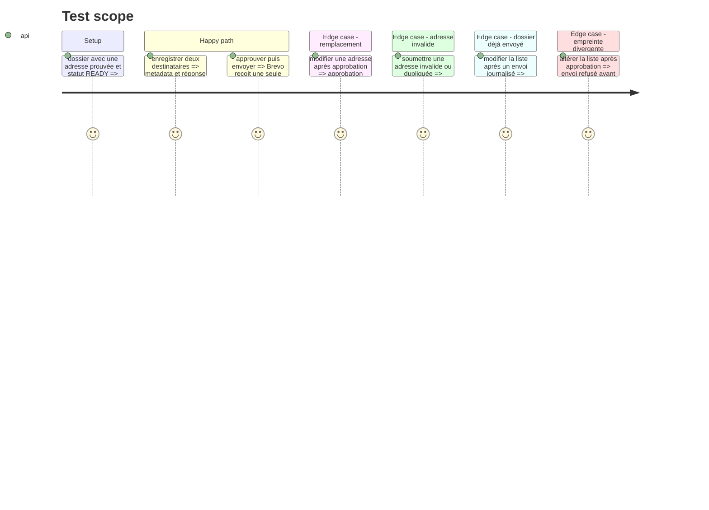

# Instruction: Contrat destinataires et sécurité d'envoi

## Architecture projection

> Tree of the final files. ✅ create · ✏️ modify · ❌ delete

```txt
applications/send.py                         ✏️ choisir et transmettre une liste de destinataires
applications/sender.py                       ✏️ accepter plusieurs entrées Brevo/SMTP
server/routes/applications.js                ✏️ lire/enregistrer/valider les destinataires et invalider l'approbation
applications/application_tracker.py          ✏️ conserver le journal multi-destinataires si nécessaire
tests/test_sending.py                        ✏️ contrôles destinataires, déduplication et verrou d'envoi
tests/test_brevo_sender.py                   ✏️ payload Brevo avec plusieurs destinataires
```

## User Journey

```mermaid
flowchart TD
  A[Adresse(s) détectée(s) ou saisie(s)] --> B[Liste choisie enregistrée dans metadata.json]
  B --> C[Approbation invalidée]
  C --> D[Nouvelle approbation]
  D --> E[Vérification de l'empreinte approuvée]
  E --> F[Un clic Envoyer par email]
  F --> H[Une requête Brevo avec un To et jusqu'à quatre Cc]
  H --> G[Journalisation et verrou anti-retry]
```

## Test Scope



## Tasks to do

### `1) Définir la représentation persistée`

> Séparer les preuves de contact de la liste de destinataires choisie.

1. Ajouter un champ versionné de destinataires dans `metadata.json`, avec adresse, rôle (`to` ou `cc`), éventuellement nom, origine (`preuve`, `ajout manuel`, `modification`) et date.
2. Pour un ancien dossier sans sélection persistée, reprendre uniquement la première adresse actuellement extraite de `job.json` en rôle `to`.
3. Une fois la sélection persistée, ne jamais y injecter automatiquement une nouvelle adresse apparue dans `job.json` ; la présenter comme preuve disponible à ajouter manuellement.
4. Limiter la sélection à 5 adresses, avec exactement un `to` et au maximum quatre `cc`.
5. Refuser les doublons insensibles à la casse et normaliser les adresses.

### `2) Étendre le pipeline d'envoi`

> Faire circuler la liste validée sans changer la règle d'un seul envoi.

1. Conserver l'extraction mono-adresse comme repli des anciens dossiers et utiliser la sélection persistée dès qu'elle existe.
2. Faire produire à `would_send` un destinataire `to`, une liste `cc` et les sources associées.
3. Adapter `EmailSender`, SMTP et Brevo à un `to` principal et une liste `cc` ; ne jamais émettre une requête par destinataire.
4. Garder l'accusé `BREVO_CONFIRM_TO` dans un second appel explicitement mono-destinataire.
5. Journaliser le `to`, les `cc`, les sources, l'identifiant d'acceptation Brevo et conserver la protection contre un second envoi.
6. Considérer la réponse synchrone de Brevo comme une acceptation globale de la requête ; le suivi ultérieur par destinataire reste consultable dans les logs Brevo et sort du périmètre de cette évolution.

### `3) Ajouter les endpoints de gestion`

> Exposer un contrat serveur sûr et cohérent avec l'approbation.

1. Ajouter une lecture de la liste effective et un endpoint de remplacement/ajout/suppression atomique.
2. Valider côté serveur les formats, doublons, la limite de 5 et la présence d'exactement un destinataire principal.
3. Invalider `APPROVED` dès que la liste change et effacer son empreinte ; lors de l'approbation, enregistrer l'empreinte canonique de la liste.
4. Faire vérifier par `/send` que l'empreinte courante correspond à l'empreinte approuvée avant tout appel fournisseur.
5. Faire utiliser par `/send` uniquement la liste persistée côté serveur, jamais une liste acceptée directement du navigateur.
6. Refuser toute modification et toute nouvelle tentative lorsqu'un envoi réussi ou échoué est déjà journalisé pour l'organisation.

## Test acceptance criteria

| Task | Acceptance criteria |
| ---- | ------------------- |
| 1 | Un ancien dossier reste envoyé uniquement vers son adresse historique ; une sélection persistée contient un `to` et zéro à quatre `cc`. |
| 2 | Brevo/SMTP reçoit une seule opération principale contenant le `to` et les `cc`, le tracker les restitue tous, et l'accusé interne reste séparé. |
| 3 | Une liste différente de l'empreinte approuvée est refusée avant appel fournisseur ; aucune adresse invalide, dupliquée ou au-delà de la limite n'est persistée. |
