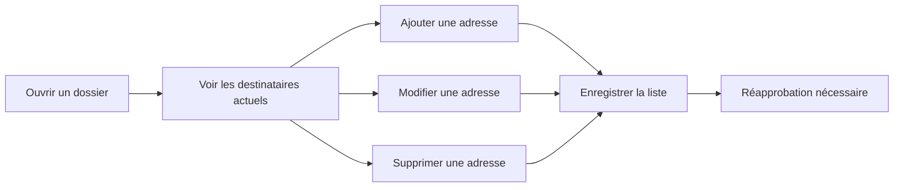
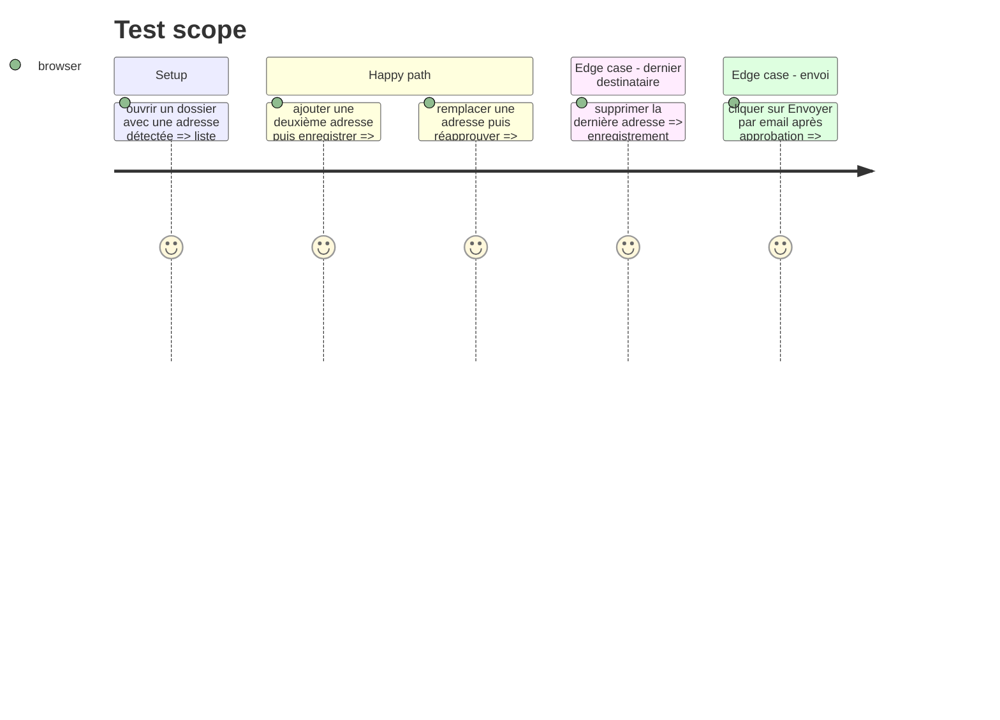

# Instruction: Interface de gestion des destinataires

## Architecture projection

> Tree of the final files. ✅ create · ✏️ modify · ❌ delete

```txt
front/src/App.jsx       ✏️ afficher, ajouter, modifier, supprimer et confirmer les destinataires
front/src/App.css       ✏️ structurer la zone de destinataires et ses états
```

## User Journey



## Test Scope



## Wireframe

```txt
┌─────────────────────────────────────────────────────────────┐
│ Dossier : entreprise / poste                                │
├─────────────────────────────────────────────────────────────┤
│ Preuves de contact                                           │
│ Adresse(s) détectée(s) : contact@exemple.fr                 │
├─────────────────────────────────────────────────────────────┤
│ Destinataires de l'envoi                                    │ 1
│ To  [ contact@exemple.fr                     ] [Modifier]   │ 2
│ Cc  [ recrutement@exemple.fr                ] [Supprimer]   │ 3
│ [ Ajouter une adresse en Cc ________________________ ]      │ 4
│ 2/5 destinataires                                           │
│ [Enregistrer les destinataires]                             │ 5
│ La liste a changé : une nouvelle approbation est requise.   │ 6
├─────────────────────────────────────────────────────────────┤
│ [Envoi approuvé] [Retirer l'approbation]                    │ 7
│ [Envoyer par email]                                         │ 8
│ Un seul envoi par dossier — Brevo envoie à la liste ci-dessus│ 9
└─────────────────────────────────────────────────────────────┘
```

## Tasks to do

### `1) Remplacer le champ conditionnel actuel`

> Donner la même gestion à une agence avec ou sans adresse existante.

1. Charger la liste effective depuis l'API et afficher le destinataire principal `To`, puis les destinataires `Cc`.
2. Permettre l'ajout, l'édition et la suppression locale avant enregistrement.
3. Garder les preuves visibles séparément, afin que l'utilisateur sache quelle adresse a été détectée et quelle adresse il a choisie.
4. Afficher le compteur sur 5 et empêcher l'ajout d'un sixième destinataire.
5. Permettre de promouvoir un `Cc` en `To`, l'ancien `To` devenant `Cc`, afin qu'il existe toujours exactement un destinataire principal.

### `2) Encadrer les actions sensibles`

> Rendre explicite l'impact sur l'approbation et l'envoi réel.

1. Afficher l'état « liste modifiée, réapprobation requise » après sauvegarde.
2. Empêcher le bouton d'envoi tant que la liste est vide, non sauvegardée, non réapprouvée ou différente de l'empreinte approuvée.
3. Afficher distinctement le `To` et les `Cc` dans la confirmation et dans le succès d'envoi.
4. Préserver le sens actuel : « Envoi approuvé » n'envoie rien ; « Envoyer par email » déclenche l'unique envoi réel.
5. Afficher le verrou définitif après une tentative déjà journalisée, réussie ou échouée.

## Test acceptance criteria

| Task | Acceptance criteria |
| ---- | ------------------- |
| 1 | Une adresse existante peut être remplacée, jusqu'à quatre `Cc` peuvent être ajoutés et l'écran garantit exactement un `To`. |
| 2 | L'écran ne permet pas d'envoyer une liste différente de celle approuvée et indique clairement le `To`, les `Cc` et le verrou après tentative. |
