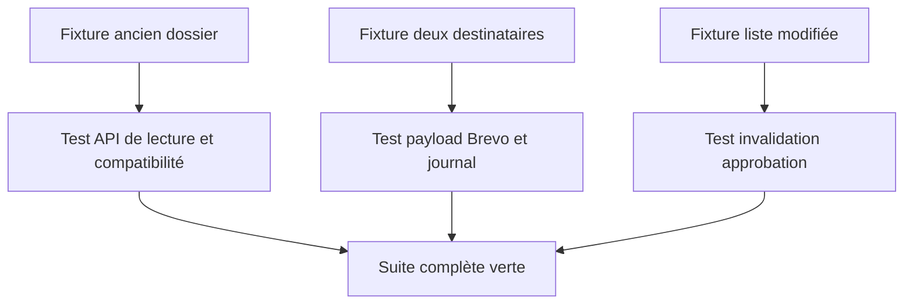
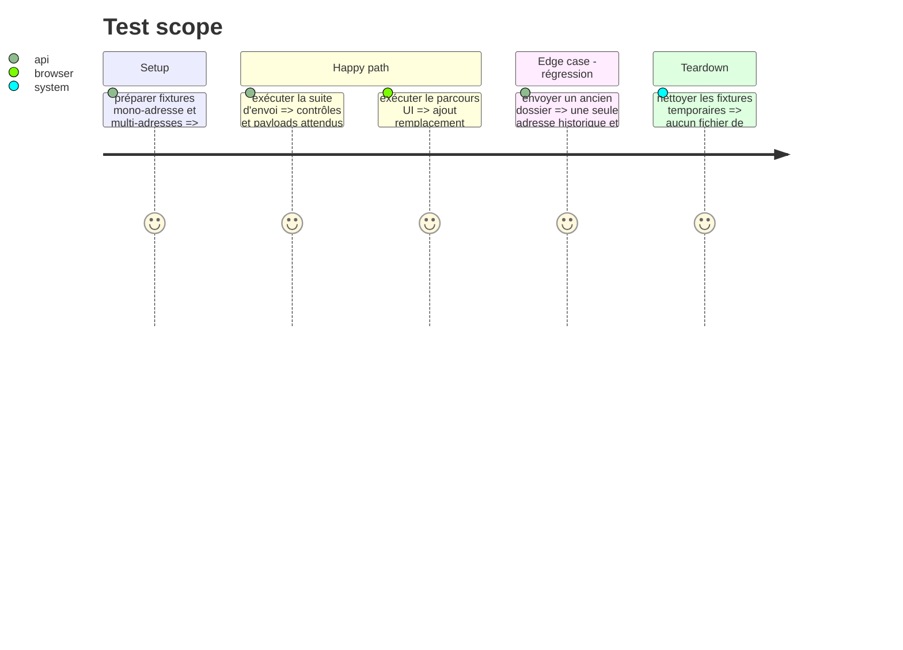

# Instruction: Tests et vérification de non-régression

## Architecture projection

> Tree of the final files. ✅ create · ✏️ modify · ❌ delete

```txt
tests/test_sending.py                 ✏️ tests de sélection, multi-destinataires et verrou
tests/test_brevo_sender.py            ✏️ test du payload `to` et `cc`
tests/test_candidatures_index.py      ✏️ compatibilité des anciennes preuves/adresses
front/package.json                    ✏️ ajouter le script et les dépendances Vitest/Testing Library
front/src/test/setup.js               ✅ configurer l'environnement de test DOM
front/src/App.test.jsx                ✅ tester la gestion des destinataires et la réapprobation
```

## User Journey



## Test Scope



## Tasks to do

### `1) Tester le contrat Python/Brevo`

> Prouver la liste finale et l'unicité de l'opération d'envoi.

1. Tester la conservation des anciens dossiers mono-adresse.
2. Tester ajout, remplacement, suppression, doublons et formats invalides.
3. Tester que le fake sender est appelé une seule fois avec un `to` et plusieurs `cc` pour l'envoi principal.
4. Tester que l'accusé `BREVO_CONFIRM_TO` reste un second appel mono-destinataire.
5. Tester le payload Brevo et les pièces jointes sans appel réseau.
6. Tester la limite de 5 et le refus d'une empreinte différente de celle approuvée.

### `2) Tester le parcours serveur/frontend`

> Vérifier que l'état affiché correspond aux verrous serveur.

1. Installer/configurer Vitest, jsdom et React Testing Library avec un script `npm test` dédié.
2. Tester le chargement de la liste et la sauvegarde.
3. Tester l'invalidation de l'approbation après changement.
4. Tester le blocage de la liste vide, du sixième destinataire et de l'envoi non réapprouvé.
5. Tester le message de confirmation et le succès avec le `To` et les `Cc`.

### `3) Vérifier le déploiement logique`

> Éviter une régression sur le contrat d'envoi existant.

1. Exécuter les tests ciblés puis la suite pertinente du projet.
2. Vérifier que les secrets Brevo restent uniquement côté serveur.
3. Vérifier qu'aucune route ne prend la liste de destinataires directement depuis le navigateur au moment de l'envoi.

## Test acceptance criteria

| Task | Acceptance criteria |
| ---- | ------------------- |
| 1 | Les scénarios mono et multi-destinataires passent ; Brevo reçoit un `to`, zéro à quatre `cc`, et jamais une requête principale par adresse. |
| 2 | Les tests Vitest prouvent que l'interface et l'API convergent sur la même liste et que les changements imposent une nouvelle approbation. |
| 3 | Les tests ciblés et la suite pertinente passent sans secret imprimé ni modification hors périmètre. |
